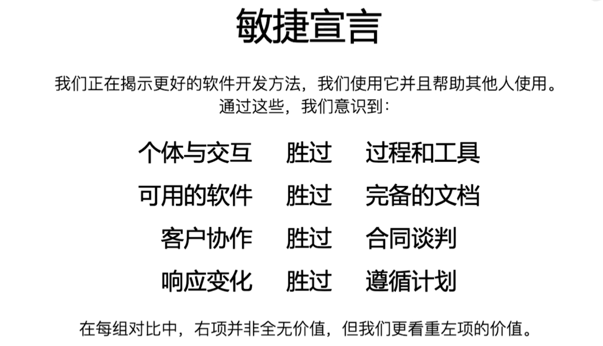
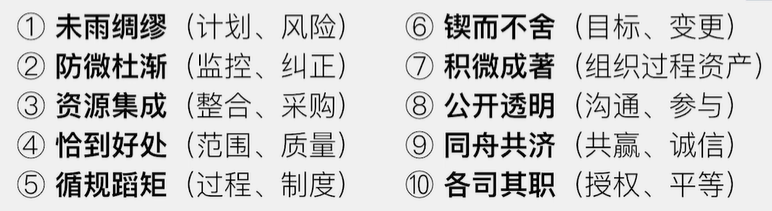

# 引论
## 概述和目的

### 项目管理的前世今生
自从有了人类活动，就有了项目

1910年，美国机械工程师和管理学家亨利·甘特发明了甘特图

1956年，美国杜邦公司和雷明顿·兰德发现，只要缩短最长路线上的活动历时，就能缩短整个项目的项目工期。**关键路径法**的出现是项目管理发展中的重要里程碑

1958年，美国海军在实施北极星导弹计划中发展出了计划评审技术（PERT）,用“**三值加权**”的方法进行工期评估，大幅度提升了计划编制的效率

1860年，华罗庚教授将项目管理引入中国。当时“项目管理”被称作统筹法和优选法

1965年，国际项目管理协会（IPMA）成立

1969年，美国项目管理协会（PMI）成立

### 初识敏捷

敏捷项目场景强调交互协作、尊重个体、相应速度，这些理念迅速得到了项目管理这点关注，尤其是在需求易变、需求要快速相应的互联网软件行业中更加受到青睐

经典项目场景中，项目团队使用瀑布开发模型，强调计划严谨、文档详细、过程合规

### 项目管理的价值观和方法论

* 未雨绸缪
  * 项目管理强调计划的重要性和风险的事前管理
* 防微杜渐
  * 实时监控，发现偏差，采取措施即时纠正
* 资源集成
  * 项目管理中强调资源集成，意思是项目经理不应该把自己困在具体的技术或业务中。
  * 项目经理的主要任务是找到合适的人去搞定这些事，这就是资源管理
* 恰到好处
  * 项目管理范围强调“做什么，且只做什么”。团队要明确要做的工作，而且之做这些工作
  * 项目质量也一样，质量不合格不行，超出标椎也不行
* 循规蹈矩
  * 《PMBOK指南》里的五大过程组（49个过程），就为我们定义了一套规范动作
* 锲而不舍
  * 虽然需求层出不穷，变更无休止，风险变幻莫测，项目风雨飘摇，我们需要克服困难、战胜风险、解决麻烦
* 积微成著
  * 项目过程中的需求跟踪、变更日志、计划更新的点点滴滴实时记录下来
* 公开透明
  * 企业要创造公开透明的氛围，鼓励每个团队成员主动沟通、积极参与
* 同舟共济
  * 项目必须有诚信、共赢的思想，目标是让各方都满意
* 各司其职
  * 授权、平等

## 基本要素
### 项目
项目是为创造独特的产品、服务或成果而进行的临时性工作
项目大致可以分为三大类
* 研发项目
* 交付项目
* 变革项目

项目的特征
* 独特性
* 临时性
* 不确定性

企业可以分为两类 甲方和乙方。无论是甲方还是乙方，企业的经营管理活动其实只有两种
* 项目：公司产品研发、为客户交付服务、管理变革等项目团队的工作
* 运营：持续的、重复的、流程化的工作