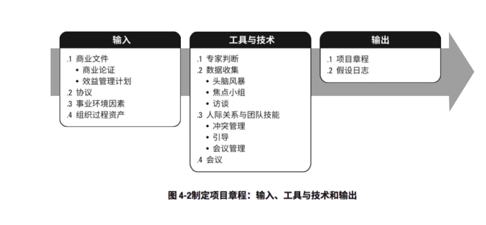
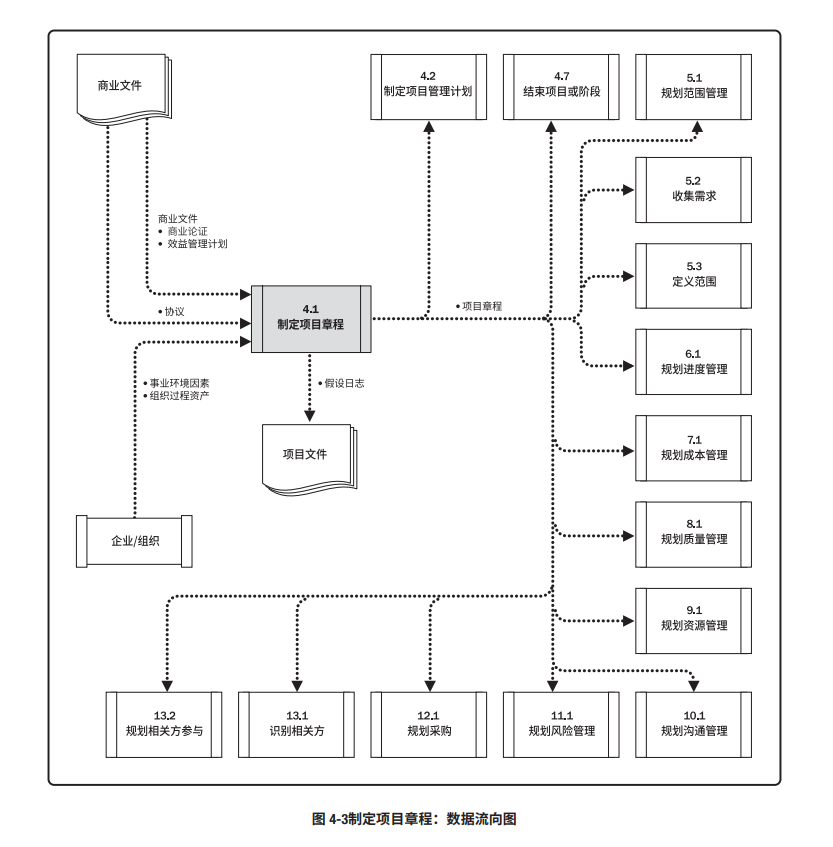
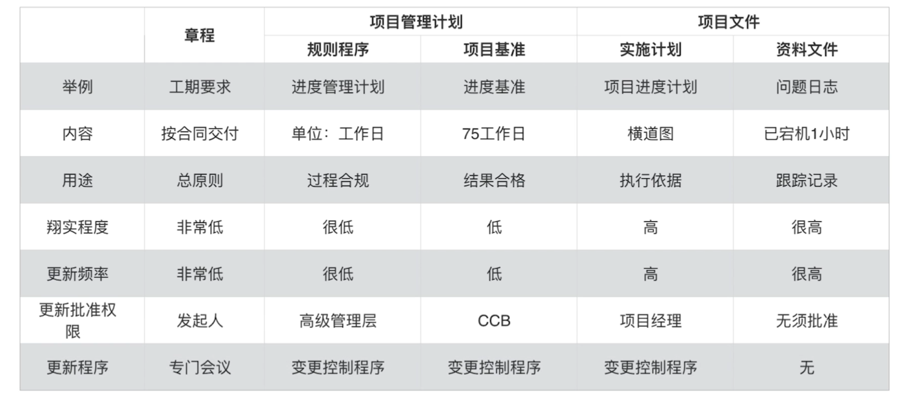

# 项目整合管理
整合什么
* 资源分配（搭团队、分工）
* 平衡竞争性需求（摆平冲突、矛盾）
* 研究各种备选方法（收益、风险整合）
* 为项目目标裁剪过程（49个过程取舍、怎么搭）
* 知识领域的关系（进度、成本）

敏捷场景下的整合管理
* 范围动态
* 过程精简
* 状态可视
* 质量内建
* 团队自组织

## 制定项目章程
* 由项目启动者或发起人发布
* 正式批准项目成立
* 授权项目经理动用组织资源开展项目活动的文件

项目章程标志
* 项目执行组织与发起组织建立起伙伴关系
* 项目知识启动
* 给项目经理正式授权

项目章程对项目经理的意义
* 看清方向
* 认清形势
* 分清责任

项目章程有发起人发布，发起人修改
## 项目计划
项目的成功离不开计划和控制

项目成本 = 任务成本 + 管理成本

### 项目管理计划和项目文件
项目管理文件
* 规则程序
* 项目基准

项目文件
* 项目的具体信息和数据

项目章程、项目管理计划和项目文件的区别和联系

### 里程碑计划
|会议|项目启动会议|项目开工会议|
|--|--|--|
|所属过程|制定项目章程|制定项目管理计划|
|所属过程组|启动过程组|规划过程组|
|召集人|发起人|项目经理|
|阶段关口|概念阶段规划阶段|规划阶段执行阶段
## 项目管理数据和信息

## 整合管理学习要点
* 整合的含义、整合的对象、整合的负责人
* 项目章程由谁发布？谁有权修改？章程的意义
* 项目的启动会议（Initiating Meetting）和开工会议（Kick-Off）的区别？
* 项目管理计划和项目文件的区别和联系
* 项目三大基准的来源、用途和变更管理
* 配置管理的含义，配置管理与变更管理的关系
* 显性知识、隐性知识和知识转移
* 工作绩效数据、工作绩效信息和工作绩效报告
* 整体变更控制程序
* 合同收尾和行政收尾的区别和联系
