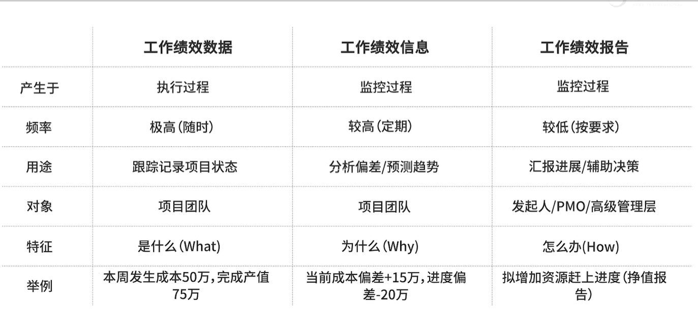
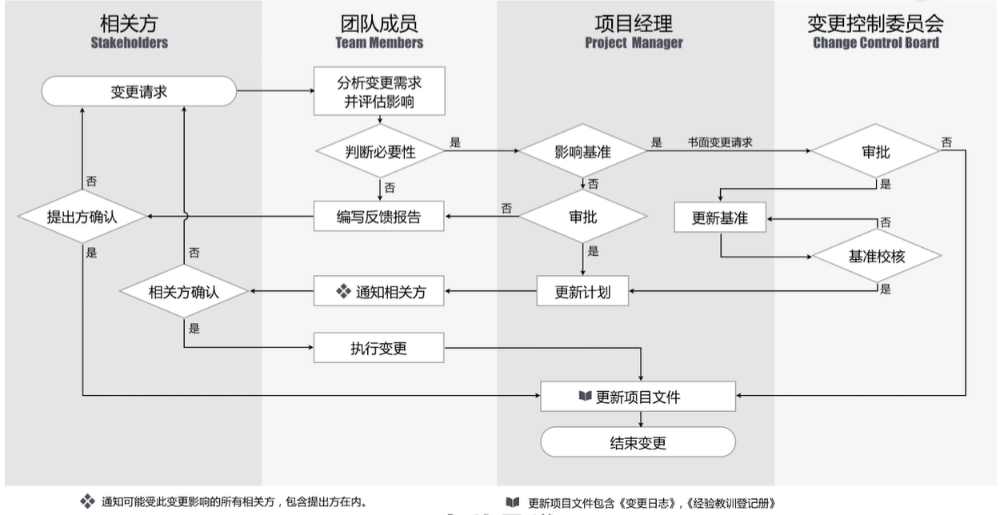
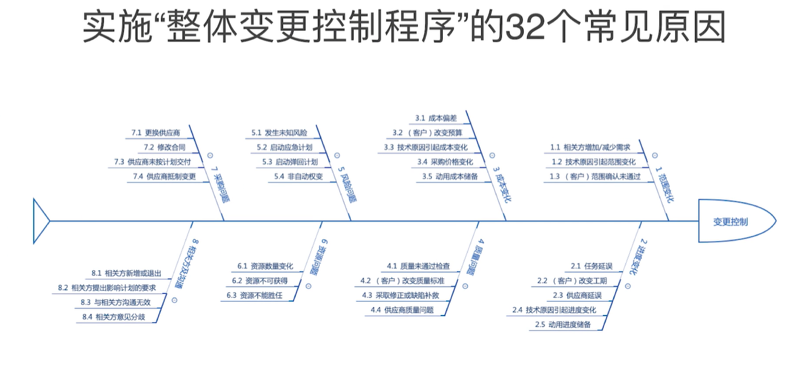
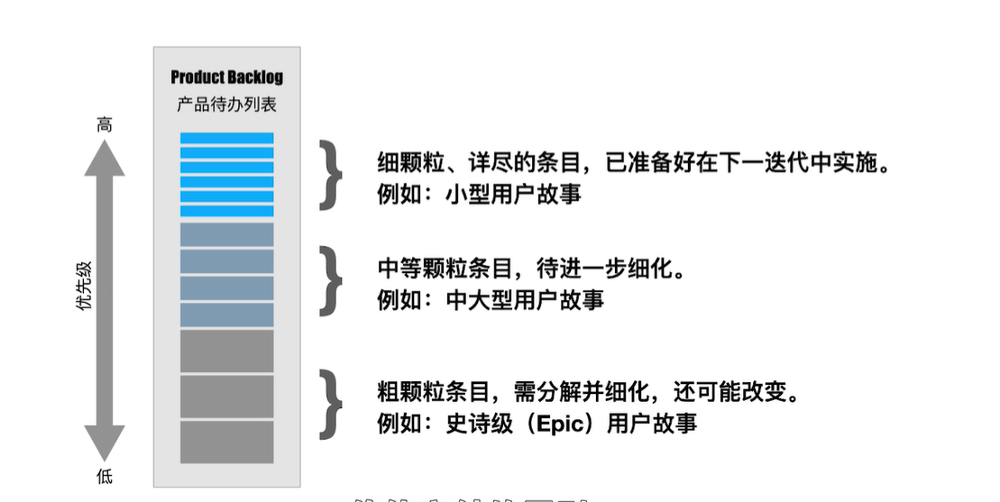
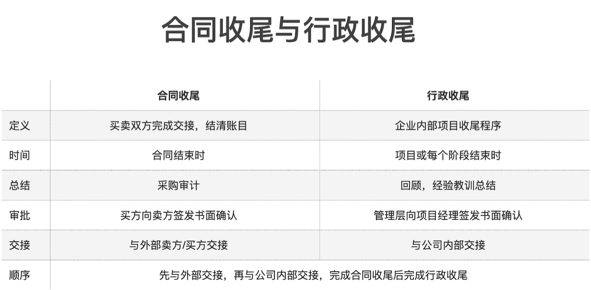

# 项目整合管理
## 制定项目章程
* 由项目启动者或发起人发布
* 正式批准项目成立
* 授权项目经理动用组织资源开展项目活动的文件

项目章程标志
* 项目执行组织与发起组织建立起伙伴关系
* 项目知识启动
* 给项目经理正式授权

项目章程对项目经理的意义
* 看清方向
* 认清形势
* 分清责任

项目章程有发起人发布，发起人修改
## 项目计划
### 里程碑计划
|会议|项目启动会议|项目开工会议|
|--|--|--|
|所属过程|制定项目章程|制定项目管理计划|
|所属过程组|启动过程组|规划过程组|
|召集人|发起人|项目经理|
|阶段关口|概念阶段规划阶段|规划阶段执行阶段

## 项目管理数据和信息
项目的数据、信息和报告
* 工作绩效数据
* 工作绩效信息
* 工作绩效报告

数据分析
* 备选方案分析（多种方案选择最优 ）
* 趋势分析（根据已知情况预测未来发展）
* 偏差分析（进度、成本、质量）

## 管理项目知识 
* 显性知识（可以编撰、易于表达）
  * 文字、图片、数字、表格
* 隐性知识（无法编撰、难于表达 ）
  * 经验直觉、洞察力、诀窍

## 变更应对措施
变更请求的影响
* 更改项目政策或程序
* 修改项目进度
* 想改项目范围
* 修改项目质量
* 修改项目预算
* 预防和纠正措施

项目更新计划
* 对基准的变更，只能针对今后的情况，而不能变更以往的绩效
* 这有助于保护基准和历史绩效数据的严肃性

变更应对措施
* 预防措施
* 纠正措施
* 缺陷补救

## 配置管理计划
* 产品的功能、组件、文档...
* 项目的基准、计划、文件...
* 组织过程资产（知识、经验、教训...）

配置管理的目标
* 完整性
* 一致性
* 可控性
* 追溯性

软件配置管理
* 版本管理
* 变更管理
* 过程管理
* 文档管理

软件开发的三种状态
* 草稿
* 正式发布
* 正在修改

软件配置管理系统
* 入门级
* 项目级
* 企业级

## 整体变更控制
计划是控制的基础，控制是计划的保证

### CCB 变更控制委员会
有项目发起人组成的一个**常设**但**非固定**的**正式**团体

### 整体变更流程图

* 通知--相关方
* 变更请求--评估影响
* 书面报告--CCB

### 敏捷场景的变更
敏捷的特征
* 小步快跑
* 高效反馈
* 保持节奏
* 价值交付

## 结束项目或阶段
### 合同收尾与行政收尾

### 知识转移
* 显性知识
* 隐性知识