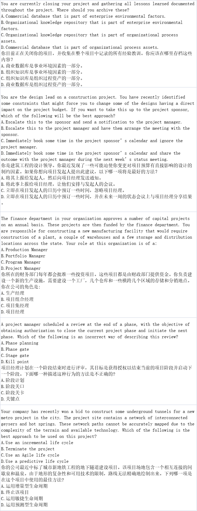

## 题目
一个项目反复出现缺陷，可能导致无法满足客户期望。项目经理首先应该使用什么来解决这个问题？
* A.开展统计抽样。
* B.准备石川图。
* C.创建一份亲和图。
* D.执行质量审计。

在项目启动大会（kick-off）期间，人力资源经理沟通说，在提供详细的项目进度计划之前将不会提供资源。若要获得资源，项目经理应该怎么做？
* A.将该问题上报给项目发起人。
* B.提交工作说明书（SOW）。
* C.创建一份详细的活动清单。
* D.参见责任分配矩阵（RAM）

一名项目团队成员被要求支持另一个职能部门三天时间。项目经理识别到这将会让项目延期五天。项目经理应使用什么技术来确定这一点？
* A.进度网络分析
* B.关键路径法（CPM）
* C.关键链法（CCM）
* D.资源平衡

## 答案
<!--  -->