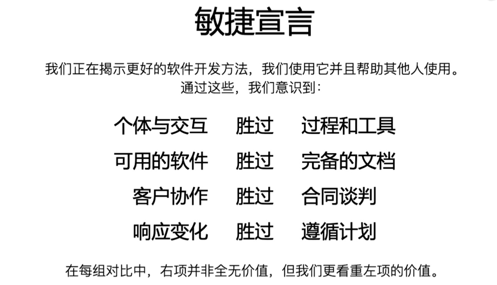
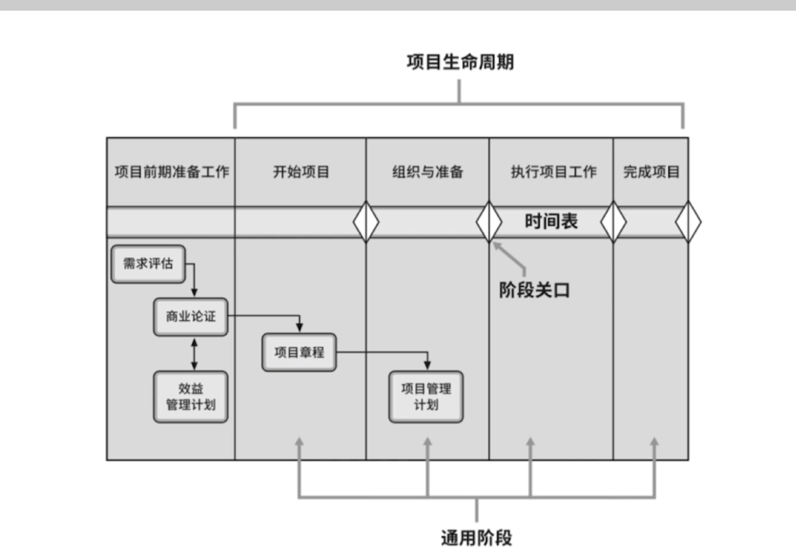
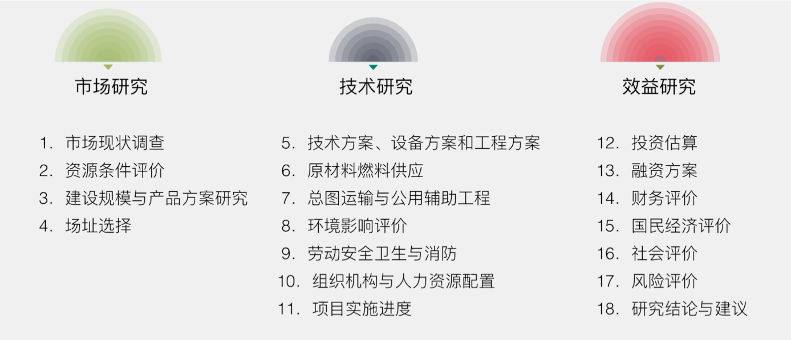
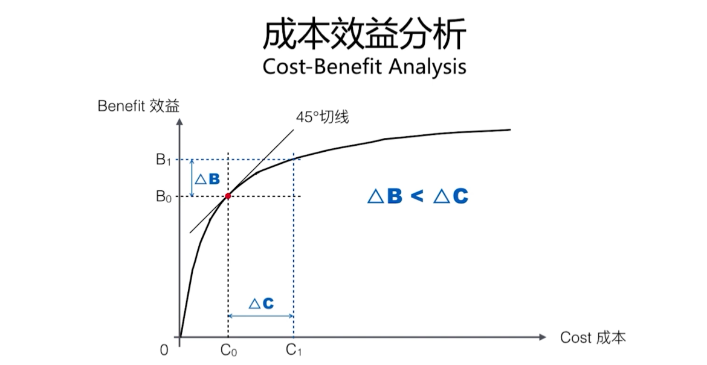

# 引论
## 概述和目的

### 项目管理的前世今生
自从有了人类活动，就有了项目

1910年，美国机械工程师和管理学家亨利·甘特发明了甘特图

1956年，美国杜邦公司和雷明顿·兰德发现，只要缩短最长路线上的活动历时，就能缩短整个项目的项目工期。**关键路径法**的出现是项目管理发展中的重要里程碑

1958年，美国海军在实施北极星导弹计划中发展出了计划评审技术（PERT）,用“**三值加权**”的方法进行工期评估，大幅度提升了计划编制的效率

1860年，华罗庚教授将项目管理引入中国。当时“项目管理”被称作统筹法和优选法

1965年，国际项目管理协会（IPMA）成立

1969年，美国项目管理协会（PMI）成立

### 初识敏捷

敏捷项目场景强调交互协作、尊重个体、相应速度，这些理念迅速得到了项目管理这点关注，尤其是在需求易变、需求要快速相应的互联网软件行业中更加受到青睐

经典项目场景中，项目团队使用瀑布开发模型，强调计划严谨、文档详细、过程合规

### 项目管理的价值观和方法论

* 未雨绸缪
  * 项目管理强调计划的重要性和风险的事前管理
* 防微杜渐
  * 实时监控，发现偏差，采取措施即时纠正
* 资源集成
  * 项目管理中强调资源集成，意思是项目经理不应该把自己困在具体的技术或业务中。
  * 项目经理的主要任务是找到合适的人去搞定这些事，这就是资源管理
* 恰到好处
  * 项目管理范围强调“做什么，且只做什么”。团队要明确要做的工作，而且之做这些工作
  * 项目质量也一样，质量不合格不行，超出标椎也不行
* 循规蹈矩
  * 《PMBOK指南》里的五大过程组（49个过程），就为我们定义了一套规范动作
* 锲而不舍
  * 虽然需求层出不穷，变更无休止，风险变幻莫测，项目风雨飘摇，我们需要克服困难、战胜风险、解决麻烦
* 积微成著
  * 项目过程中的需求跟踪、变更日志、计划更新的点点滴滴实时记录下来
* 公开透明
  * 企业要创造公开透明的氛围，鼓励每个团队成员主动沟通、积极参与
* 同舟共济
  * 项目必须有诚信、共赢的思想，目标是让各方都满意
* 各司其职
  * 授权、平等

## 基本要素
### 项目
项目是为创造独特的产品、服务或成果而进行的临时性工作
项目大致可以分为三大类
* 研发项目
* 交付项目
* 变革项目

项目的特征
* 独特性
* 临时性
* 不确定性

企业可以分为两类 甲方和乙方。无论是甲方还是乙方，企业的经营管理活动其实只有两种
* 项目：公司产品研发、为客户交付服务、管理变革等项目团队的工作
* 运营：持续的、重复的、流程化的工作

### 裁剪
裁剪什么
* 49个过程
* 过程的输入、工具技术、输出
* 声明周期：阶段划分
* 开发方法：增量、迭代、适应、混合
考虑什么
* 范围、进度、成本、资源
* 质量、风险间的相互制约
* 项目环境
* 组织文化
* 相关方需求  
### 项目商业文件
| 项目商业文件 | 定义
|--- |--- |
| 项目商业论证 | 文档化的经济可行性研究报告，用来对尚缺乏充分定义的所选方案的收益进行有效性论证，是启动后续项目管理活动的依据
| 项目效益管理计划 | 对创造、提高和保持项目效益的过程进面定义的书面文件

和文件有关的人
* 组织负责人
* 项目发起人
* 项目经理

有关的文件
* 组织目标（战略）
* 项目商业论证
* 项目章程
* 项目效益管理计划
* 项目计划

|有关的人  | 有关的文件
|--- |--- |
| 组织负责人| 组织目标（战略）|
| 项目发起人 | 项目商业论证、项目章程 |
| 项目经理 | 项目效益管理计划、 项目计划 |

项目可行性研究包含的内容

#### 商业论证
商业论证中的财务测量指标
* 投资回报率 ROI：投资带来的年化收益率
* 投资回收期 PBP：收回投资的年限
* 净现值 NPV
* 内部收益率 IRR
* 效益成本比率BCP
## 财务测量指标
### 静态评价法
* 投资回报率 ROI = 年均利润/投资额
* 投资回收期 PBP
  * 当各年净现金流相等：PBP =  1/ROI
  * PBP = 累计现金流为正的第几年 - 1 + 累计现金流为正的前一年的累计净现金流的绝对值 / 累计净现金流为正的当年的净现金流
  
投资回报率（ROI）= 年均利润/投资额

 ### 动态评价法
 
i为基准折现率
 * 复利计算：终值 = 现值 * (1+i)n
 * 折现计算：现值 = 终值 / (1+i)n

净现值 NPV ：折现后净现金流的累计(NPV越大越好)
内部收益率 IRR： NPV为0是的利率就是内部收益率IRR

### 多项目比较
NPV一样，IRR越大越好（抗风险能力强）
### 效益成本比率BCP 
效益成本比率BCP = 效益增加 / 增加成本

随着成本增加，收益会逐渐放缓

如图，45°切线是个分水岭，C0之前投入都是划算的，之后就不划算了
