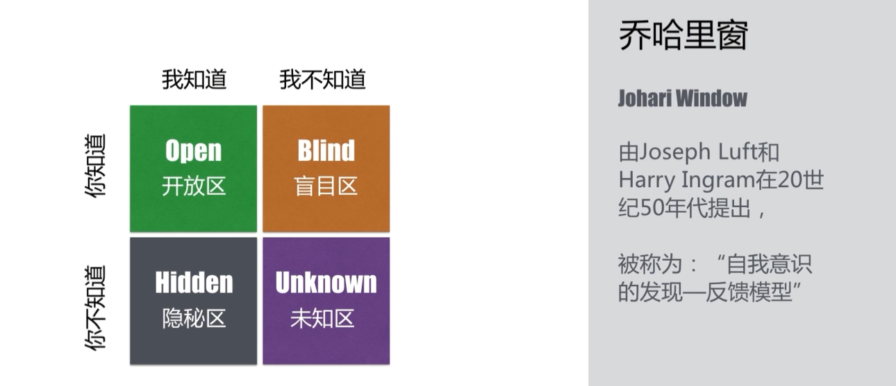
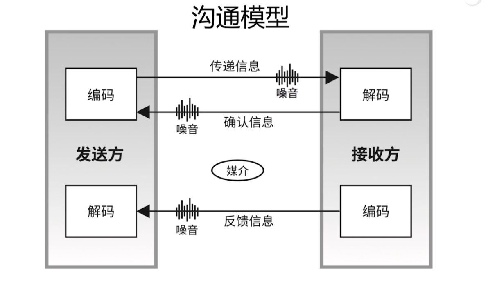
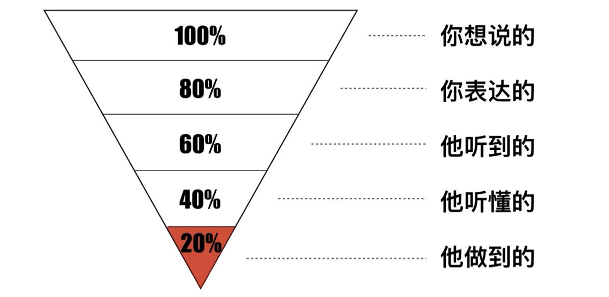
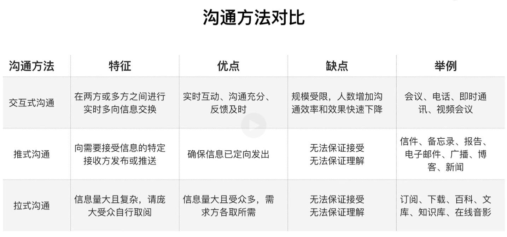
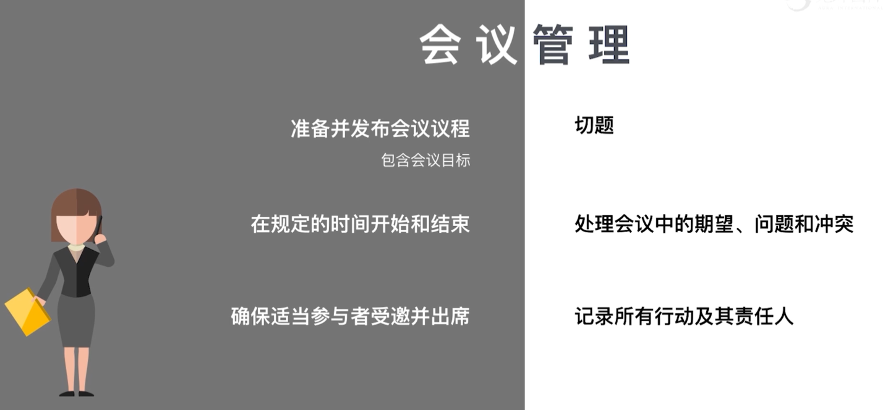

# 沟通管理
在项目中，大部分冲突、挫折和低效率都是由于沟通不畅造成的

项目管理者75%-90%的时间都会花费在项目相关方的沟通上

* 规划沟通管理
* 管理沟通
* 监督沟通
## 规划沟通管理
### 有效的沟通
有效的沟通是指以正确的形式、在正确的时间把信息提供给正确的受众，并使信息产生正确的影响

### 沟通的方式
* 内部和外部
* 正式和非正式
* 垂直和水平
* 官方和非官方
* 书面和口头
* 言语和体语

乔哈里窗

书面沟通 5C 原则
* 正确的书写和拼写
* 简介的描述和无多余字
* 清楚的目的和描述（适合读者需要）
* 连贯的思维逻辑
* 受控的语句和想法承接

规划沟通管理需要考虑的问题
* 谁需要什么信息和谁有权接触这些信息
* 什么时候需要信息
* 信息应存储在什么地方
* 信息应以什么形式存储
* 如何检索这些信息
* 是否需要考虑时差、语言障碍和跨文化因素

沟通基本模型

沟通漏斗

沟通路径

  

过滤
* 指大量信息在自上而下或自下而上的沟通过程中损失掉的现象

### 沟通障碍
* 沟通过载
* 缺少知识
* 文化差异
* 分散注意力的环境因素
* 有害的态度
* 不良情绪
* 不懂行业术语和技术术语
* 沟通渠道过多
* 选择性认知

产生沟通障碍的原因
* 不同相关方对项目目标的理解不同
* 人力、设备、材料等资源的竞争
* 人员之间的个人冲突
* 对变化的抵制

### 沟通技术
* 简化运用语言
* 视觉辅助手段
* 积极倾听
* 有效的反馈
* 情绪控制

沟通的方法
* 交互式沟通
* 推式沟通
* 拉式沟通

## 管理沟通
### 会议管理

## 监督沟通

## 知识点
* 沟通占用项目管理者的多少精力
* 沟通类型
* 沟通模型
* 沟通漏斗
* 沟通路径
* 沟通方法