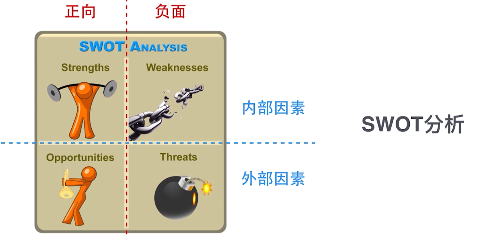
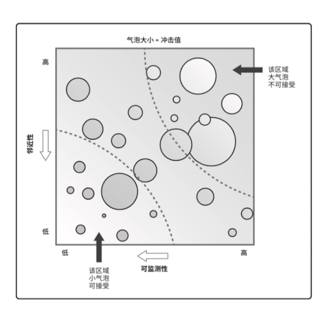
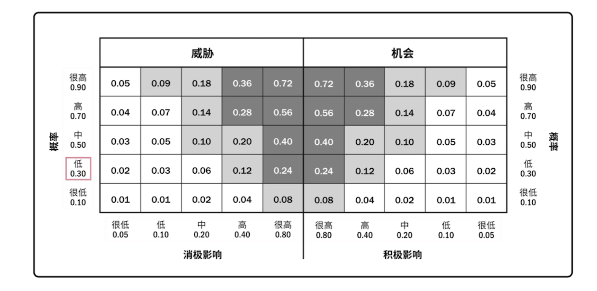
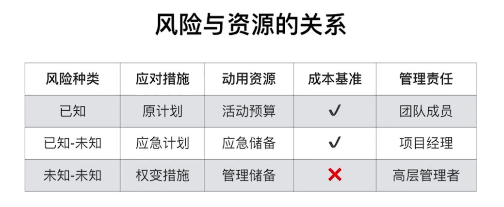
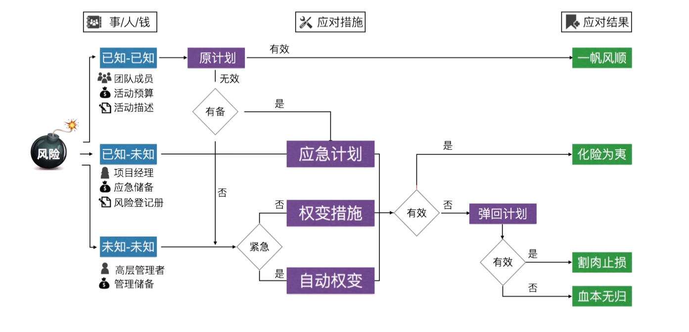
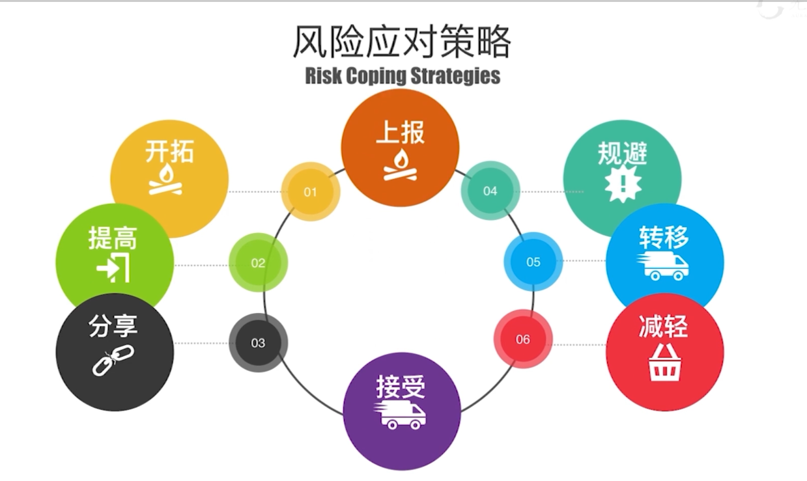

# 风险管理
风险来源于不去定性，包括负面的威胁和正面的机会

风险敞口：

单个项目风险和整体项目风险

变异性风险

模糊性风险

项目韧性：当项目遭遇风险时，还能维持状态的能力、迅速恢复的能力

整合是风险管理：在项目、项目集、项目组合及项目所在组织进行多层次的风险统筹管理

## 规划风险管理
### 风险的分类
* 已知-未知风险 和 未知-未知风险
* 内部风险和外部风险
* 商业风险和可保险风险

### 风险分解结构

### 相关方对风险的态度
风险偏好（主观）和风险承受力（客观）有关

通常用风险临界值来表示相关方对风险的态度

## 识别风险
识别风险的几种方法
* 头脑风暴法
* 德尔菲法
  * 专家匿名方式提交意见
* 根本原因分析
* 核对单分析
* 假设分析
* 鱼骨图分析
* 系统或过程流程图
* 专家判断
  * 注意专家的偏见
  * 重视专家的直觉
* 建设条件和制约因素分析
  * 假设条件：不确定，经验推断
  * 制约因素：已确定，客观存在
* SWOT分析
* 提示清单
* 战略框架
* 层级图（气泡图）
  * X轴代表可检测性，Y轴代表临近性，气泡大小表示影响值

气泡图

## 实施定性分析
### 风险概率和影响评估量表
可以消除评价者主观因素的影响
### 风险概率和影响矩阵
每个风险打两个分：概率分和影响分

风险概率和影响矩阵

深灰色区域的风险意味着风险高且影响大，应列入风险短名单重点管理，并且有针对行动编制风险应对计划

剩下的风险，将其列入风险观察清单

## 实施风险定量分析
就已识别的风险对项目整体目标的影响进行定量分析的过程
* 模拟
  * 利用计算机模拟的方法产生抽样结果，根据抽样计算统计量或参数的值
* 敏感性分析
* 决策树
* 影响图
  * 风险间的联系

## 规划风险应对
### 风险的应对风险
* 应急计划
* 弹回计划
  * 保底计划
* 权变计划
  * 未随机应变

风险应对方法的使用场景

### 风险应对策略
负面
* 规避
* 转移
* 减轻
正面
* 开拓
* 提高
* 分享

