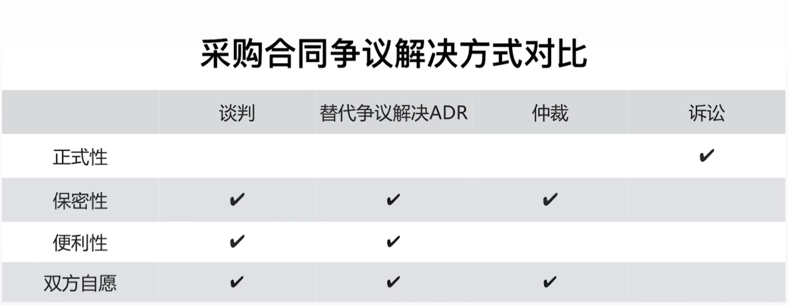
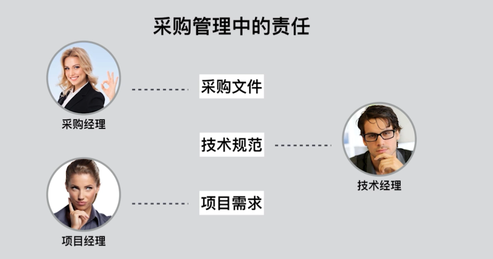
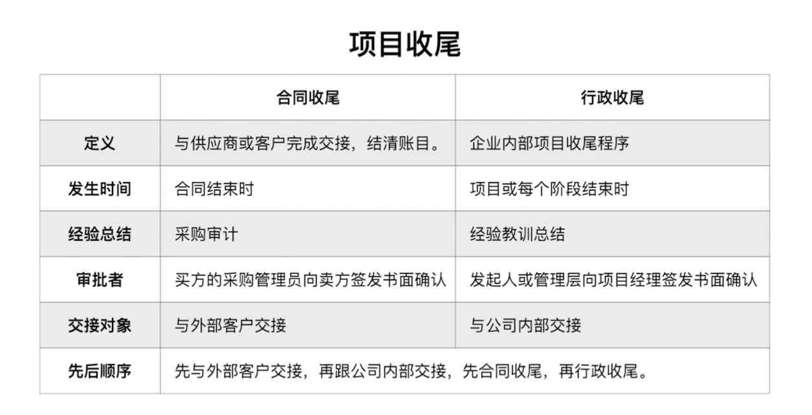

# 采购管理
采购管理的核心概念
* 包括从项目团队外部采购或获得所需**产品**、**服务**或**成果**的过程

建筑信息模型BIM

国际标准采购合同范本
* 国际咨询工程师联合会（FIDIC）
* 美国建筑师协会（AIA）
* 英国土木工程师协会（ICE）
* 世界银行（World Bank）

敏捷场景下的采购管理
* 通过主要服务协议（MSA）来管辖整体协作关系，用附录或补充文件记录适应型的工作内容

## 规划采购管理
### 采购合同类型
#### 总价类合同
* 固定总价合同（FFP）
* 总价加激励费用合同（FPIF）
  * 目标成本
  * 目标利润（费用）
  * 最高限价
  * 分成比例
  * 总付款 = 目标成本 + 目标利润 + （实际成本 - 目标成本）* 买方分成比例
  * 总付款 < 最高限价，按总付款付
  * 总付款 >= 最高限价，按最高限价付
* 总价加经济价格调整（FP-EPA）
  * 合同总价可以根据物价变动等因素调整

#### 成本类合同
* 成本加固定费用合同（CPFF）
  * 成本实报实销，按照约定固定数额支付费用
* 成本加激励费用（CPIF）
  * 成本按预算 + 约定费用，超支或节约，按约定比例分担
* 成本加奖励费用（CPAF）
  * 成本实报实销，甲方根据表现给乙方费用（看甲方心情）
* 工料合同
  * 工作内容明确，人工和材料成本不明确

||总价类合同|成本补偿类合同|
|-|-|-|
|项目范围|明确|不明确
|不确定性|低|中|
|风险承担|乙方|甲方、乙方|
### 采购文件
* 招标文件
  * 信息邀请书RFI
  * 报价邀请书RFQ
  * 建议邀请书RFP
* 采购工作说明书（SOW）
* 工作大纲（TOR）

### 项目交付方式
* DDB模式（设计-招标-建造模式）
* 总承包模式（EPC）
* 特许经营
  * BOT模式
    * 政府将项目移交给企业进行并准许一定期限的运营，企业通过运营回收项目成本并获得利润，到期后移交给政府
  * BT模式
    * 政府将项目移交给企业，企业完成后，将项目移交给政府，没有运营环节
  * PPP模式
    * 公私合营模式，按股份比例出资，并按股份比例分享码项目收益

### 自制外购分析
* 自制是指在项目执行组织内部完成的某一项工作
* 外购是指从组织外部获得所需的产品、服务或成果

|自制的原因|外购的原因|
|-|-|
|自制成本低|外购成本低|
|保证供应充足|降低库存压力|
|无合适的供应商|保留对供应商的许诺|
|利用过剩劳动力|生产力不足|
|获得供应的主动性|获得技术或管理能力|
|排除供应商之间的勾结|获得供应的灵活性和可替代性|
|保护专利或商业机密|产品受到专利或商业机密的保护|
|自制质量可靠|外购质量可靠|
|维持组织的规模或能力|享受配套的售后服务|
### 供方选择分析
|选择依据|使用场景|选择标椎|
|-|-|-|
|成本最低|有成熟的标准、明确的范围和预期成果|选择出价最低者|
|资质|采购价值小，不值得大费周章|买方从短名单中选择等级最高、经验和历史业绩最佳的投标人
|质量或技术方案|买方最看重质量或技术方案|在评估技术建议书时，只要成本可接受，就选择技术方案或质量得分最高的投标人|
|质量和成本得分|买方最看重质量和成本，适合不确定性较高的项目|选择质量和成本得分最高的投标人|
|独有来源|有依据证明没有别家可以提供相同的产品或服务|独此一家，别无选择|
|固定预算|工作说明书对工作定义得完整、准确，预期不会发生变更，并且预算是固定的，不能超出预算|预算是公开的，选择技术建议书得分最高的投标人|
## 实施采购
### 实施采购的工具和技术
* 独立估算
* 投标人会议
* 采购谈判
  * 在合同签署之前，对合同内容加以澄清

||投标人会议|采购谈判|
|-|-|-|
|召开时间|投标前|投标后|
|邀请参与方|所有符合条件的投标方|中标方|
|要澄清的内容|招标文件|合同|

## 控制采购
* 索赔管理
* 采购审计
  * 合规性
* 采购合同争议解决方式
  * 谈判
  * 替代争议解决ADR
  * 仲裁
  * 诉讼

采购合同结束方式

## 知识点
* 敏捷中的采购管理
* 各种采购合同形式
* 各种采购文件
* 各种交付方式
* 自制外购分析
* 供方选择分析
* 投标人会议与采购谈判
* 采购合同争议解决
* 采购合同收尾与行政收尾
* 采购合同中各方的责任