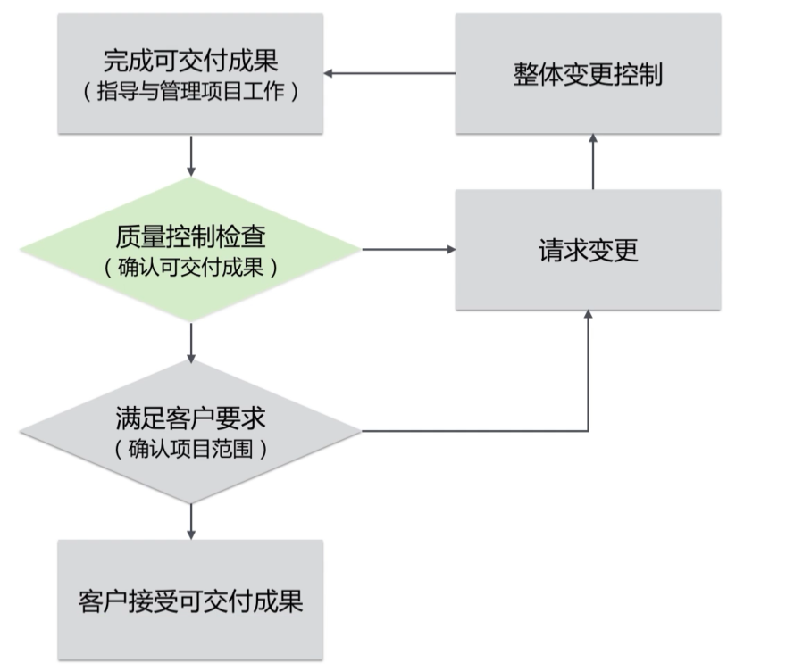
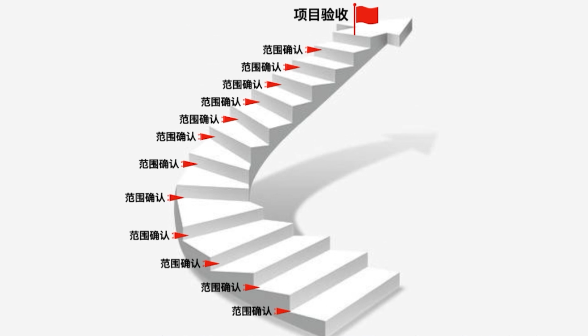

# 项目范围管理
范围管理的目标
* 要做什么
* 只做什么
范围包括
* 产品范围
* 项目范围

不同生命周期的范围管理对比
||预测型（瀑布）|迭代型/增量型|适应型（敏捷）|
|-|-|-|-|
|定义范围的时间|项目开始|每个迭代开始|随时|
|确认范围时间|项目结束|每个迭代结束|随时反馈|
|范围控制你文件|范围基准|版本配置文件|用户故事|
|发起人/客户参与|里程碑|周期性|持续性|

## 收集需求
* 需求：想要的
* 范围：要做的

收集需求的方法
* 头脑风暴
* 访谈
* 焦点小组
* 问卷调查
* 标杆对照
* 联合应用设计或开发（JAD）

## 收集需求的工具
* 亲和图
* 思维导图
* 质量功能展开
* 头脑风暴

## 需求决策与表现
* 投票
* 独裁
* 多标准决策（MCDA）

## 人际关系与团队技能
* 民义小组
  * 小组成员不通气，独立思考
  * ...
  * 最后投票
* 观察法
* 引导式研讨会

## 系统交互图和原型法
* 系统交互图
* 原型法
* 故事板（可视化故事板）

## 需求跟踪矩阵
## 需求管理
### 敏捷场景下的需求管理
* 卡诺模型
* 精益画布
* 莫斯科法则
  *  必须有
  *  应该有
  *  可以有
  *  不该有
* WSJF原则

## 用户故事和用户故事地图
角色，功能，目的

作为一个[用户]，我想...,以便于...

## 项目范围说明书
## WBS工作结构分解
* 子项目
* 控制账户
* 工作包（项目经理）
* 规划包
* 活动(团队)
* 任务（个人）

## 责任分配矩阵
负责人有且只有一个

WBS工作分解结构的价值
* 基准的来源
  * 范围 
  * 进度
  * 成本
* 计划的基础
* 工作的展现
* 控制的依据
* 团队的指南

## 确认范围
### 确认范围与质量控制

### 确认范围与项目验收

确认范围应该化整为零，分期分批尽早完成

## 控制范围
### 范围蔓延
范围蔓延就是未经控制的产品或项目范围的扩大
* 镀金（项目团队主动增加的额外工作）
* 爬行（客户要求下未经正常的范围变更控制程序而出现的产品或项目范围的扩大）

