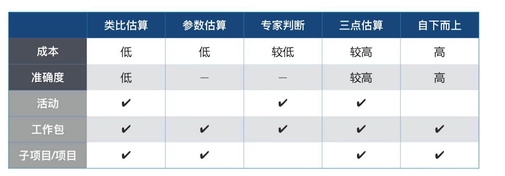

# 项目进度管理
* 规划进度管理
* 定义活动
* 排列活动顺序
* 估算活动持续时间
* 制定进度计划
* 控制进度

* 按需进度计划
* 具有未完成项的进度计划
## 时间的特征
* 不等人
* 有上限
* 对谁都公平

敏捷
* 团队
* 用户

## 看板动画
精髓：拉动式生产（按需进度计划）

六大核心实践
* 可视化工作流程
* 限制在制品
* 管理和度量流动
* 显示化流程管理
* 建立反馈环路
* 协作式改进

## 洋葱圈规划
## 紧前关系绘图法(PDM)
* FS（finish->start）
* SS（start->start）
* FF（finish->finish）
* SF（start->finish ）

项目中的依赖关系
* 内部依赖
* 外部依赖
* 强制性依赖
* 选择性依赖

## 滞后量与提前量
* 滞后量的作用是让计划有了弹性
* 提前量是缩短工期的重要方式

前导图（PDM）
## 估算活动的持续时间
### 估算资源

* 学习曲线
* 边际效益递减规律

资源管理工具
* 资源日历
* 资源直方图

## 活动历时估算方法
* 专家判断
  * 可能存在偏见，甚至估算失误
* 类比估算
  * 通过比照项目之间的参照值来估算相似活动时间和资源数量
  * 优点是经济高效，缺点是准确度不高
* 参数估算
  * 利用成熟的估算模型，通过输入相应的技术参数来估算工期
  * 对模型的成熟度及参数的准确性依赖极高
* 三点估算
* 自下而上估算，从活动自下而上到项目
  * 耗时费力，成本较高

### 三点估算
最乐观时间 O ，最可能时间 M ，最悲观时间 P 来计算概率分布值

* β分布期望值计算公式：Te = (O + 4M + P) / 6
* 标椎差 σ = (P - O) / 6
* 三角分布 Te = (O + M + P) / 3
* 正态分布，知道期望值 Te 与标椎差 σ
  *  ± σ 68.26%
  *  ± 2σ 95.46%
  *  ± 3σ 99.73%

## 五种估算方式对比

## 敏捷估算扑克

## 储备分析
进度储备，用来应对进度中的不确定性

风险的分类
* 已知风险
* 已知-未知风险
  * 知道风险，但不知道概率和影响
* 未知-未知风险
  * 无法识别的风险

* 应急储备
  * 包含在进度基准中
* 管理储备
  * 不包含在进度基准中，但输运项目总进度计划的一部分

||应急储备|管理储备|
|-|-|-|
|支配者|项目经理|高层管理者|
|应对风险的类型|已知-未知风险|未知-未知风险|
|是否包含在进度基准中|是|否| 

## 制定进度计划
制定进度计划常用的方法
* 里程碑计划
  * 计划：把项目分成阶段目标
  * 控制：强制约束，控制各个阶段目标的实现
  * 沟通：与管理层、干系人良好沟通
  * 责任：明确规定了项目各方的责任义务
  * 报告：简明、生动、通俗、实用
* 横道图（甘特图）
  * 直观形象、通俗易懂
  * 缺点：无法展示浮动时间和关键路径
* 网络图
  * 单代号网络图和双代号网络图
  * 时标网络图
* 进度前锋线图

## 关键路径法CPM
关键路径发参数
<table>
<tr><th>最早开始</th><th>活动历时</th><th>最早结束</th></tr>
<tr align="center"><td colspan="3">活动名称或代号</td></tr>
<tr><td>最早开始</td><td>总浮动时间</td><td>最晚结束</td></tr>
</table>

## 项目的3种浮动时间
* 自由浮动时间
  * 不影响后续工作最早可以开始的前提下，这项工作可以拖延的时间
* 总浮动时间
  * 不影响项目总工期的前提下，活动可以拖延的时间
* 项目浮动时间
  * 在计划工期的基础上，发起人主动让出的时间
## 关键链法
使用三点估算50%完成的概率 + 项目经理预留的项目缓冲
## 资源优化
* 资源平衡
  * 利用非关键路径上的浮动时间，活动只在浮动时间范围内提前或延后
* 资源平滑
  * 调整非关键路径上的，是项目资源数量波动减少

## 进度压缩技术
压缩关键路径
* 快速跟进
  * 后续活动提前开始
  * 增加了后续工作“返工”的风险
* 赶工
  * 增加资源换取时间

## 燃尽图

## 知识点
* 提前量：相对于紧前活动，紧后活动可以提前的时间量
* 滞后量：相对于紧前活动，紧后活动需要推迟的时间量