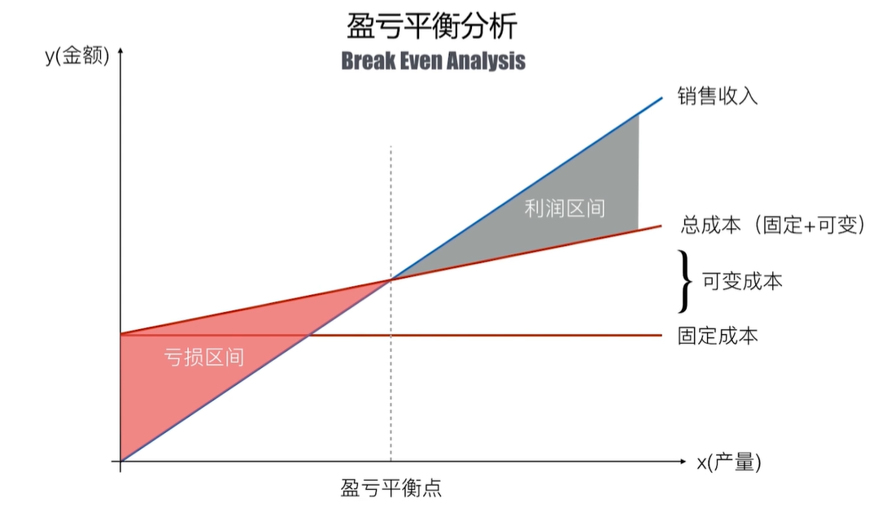

# 成本管理
* 规划成本管理
* 估算成本
* 指定预算
* 控制成本

成本的分类
* 直接成本
* 间接成本

机会成本
 * 选择了可选方案中的一种，放弃其他方案，在放弃方案中潜在收益最大的就是做出这次选择的机会成本
沉没成本
 * 已经花费的成本（不可回收的支出）

全声明周期成本
* 产品全声明周期中发生的所有成本

## 敏捷场景下的成本管理
当有一个想法时，可以先开发一个最小可行性产品
* 视频
* 仿真
* 众筹
* 原型
* 预售
* 访谈

## 估算成本
* 资金限制平衡

## 控制成本
### 挣值分析
* 计划值（PV），到评估时刻为止，实际将要花费的成本
* 实际成本（AC），实际花费的成本
* 挣值（EV）：到评估时刻为止，实际完成有效工作所对应的被认可的成本
* 进度偏差（SV）：EV-PV
* 成本偏差（CV）：EV-AC
* 进度绩效指数（SPI）：EV/PV
* 成本绩效指数（CPI）：EV/AC
### 完工速算（EAC）
挣值分析的状态和纠正措施
* 完工预算（BAC）:计划中完成全部工作所需要的成本
* 完工估算（EAC）
  * 按当前实际单价继续到项目结束：`EAC = BAC / CPI` (成本不纠正)
  * 接下来的工作将按照计划单价完成：`EAC = AC + (BAC - EV)` (成本纠正
  * 进度和成本都按当前状态继续到项目完成：`EAC = [(BAC-EV)/(CPI*SPI)]`
* 完工偏差（VAC）：`VAC = BAC - EAC`

### 完工尚需绩效指数（TCPI）
* 初始的TCPI `TCPI = (BAC - EV) / ( BAC - AC)`
* 现在的TCPI `TCPI = (BAC - EV) / ( EAC - AC)`

### 挣得进度（ES）

