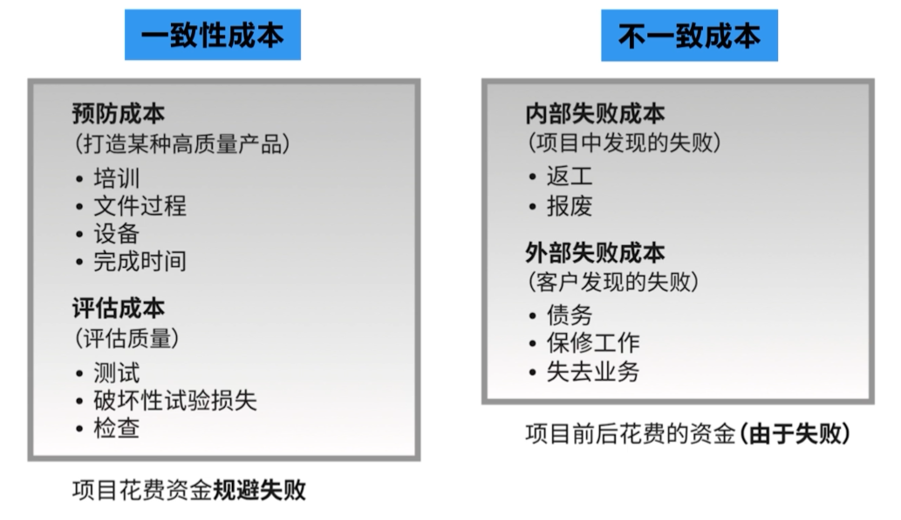
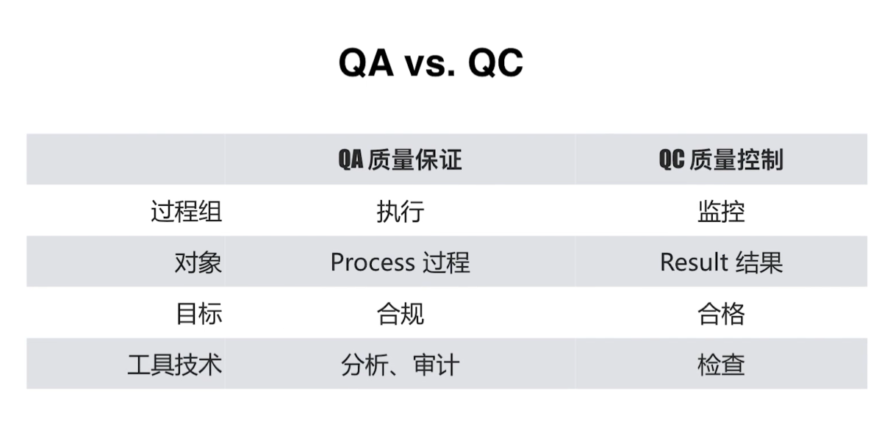
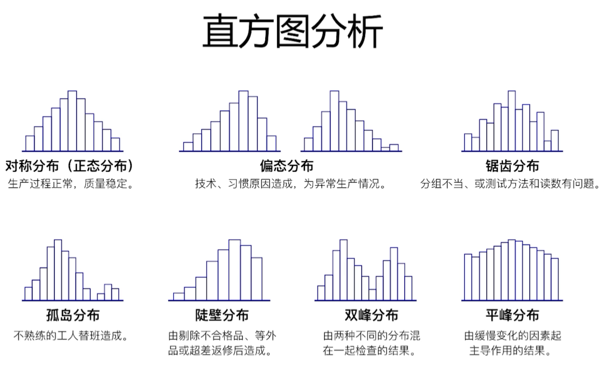
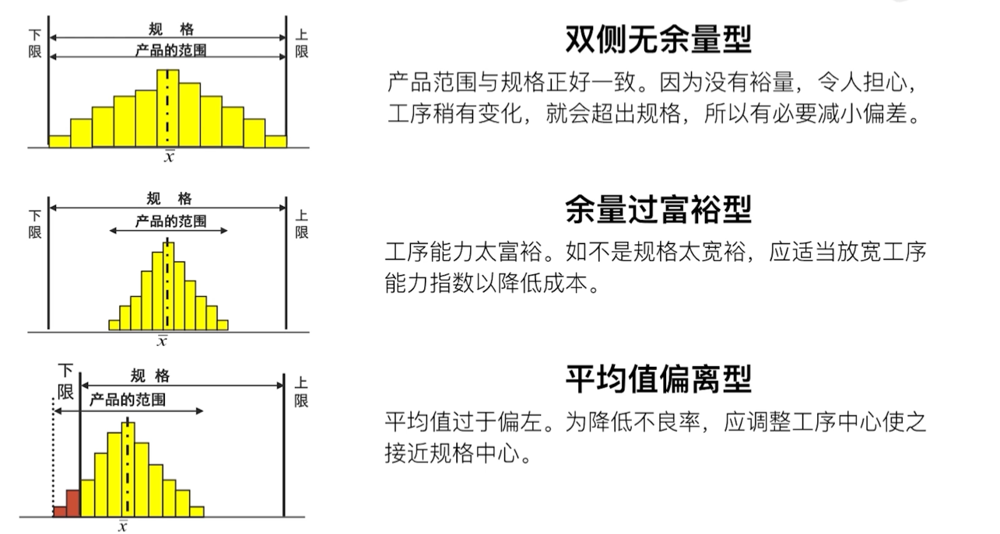

# 项目质量管理
* 等级 != 质量
* 精确度 != 准确度

## 质量管理水平
* 用户发现缺陷
* 检查和纠正
* 过程保证
* 设计优化
* 全员参与的质量管理文化

## 质量管理的发展趋势
* 客户满意
  * 符合要求、适于使用（全面质量管理）
* 持续改进
  * 戴明环（PDCA）
* 管理层的责任
* 与供应商持续合作，互利共赢

质量成本COQ

克劳斯比的观点
* 第一次就把工作做对，总是最划算的
* 质量产生于预防，而不是“评估”
* 质量成本是以“不符合要求的代价”衡量的

田口玄一
* 质量偏离目标值越大，损失越大

## 规划质量管理
质量矩阵图

面向X设计
* DfM(面向制造的设计)
* DfA(面向装配的设计)

### 质量管理工具
* 因果图（鱼骨图）
* 直方图
  * 基本符合正态分布
  * 产品数据全部在规格以内
  * 均值和规格一致
  * 规格线位于4倍标准差的位置
* 散点图
  * 通过变量之间的相关性来分析质量问题产生的原因
* 检查表
  * 计数表，用于收集数据的核对清单
* 帕累托图
  * 二八原理，80%的问题是由20%的原因造成的

几种应纠正的直方图形态

