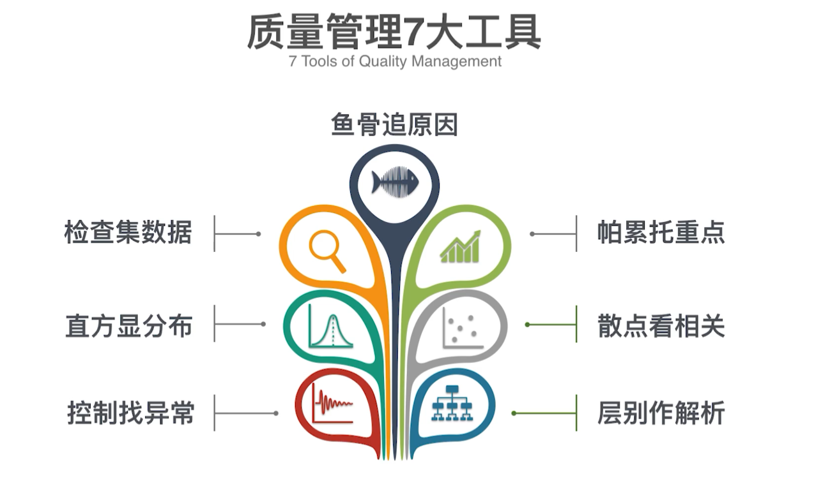

# 项目质量管理
* 规划质量管理
  * 识别项目及其可交付成果的质量要求（或标准），并书面描述项目将如何符合质量要求（或标准）的过程
* 管理质量
  * 把组织的质量政策用于项目，并将质量管理计划转化为可执行的质量活动的过程
* 控制质量
  * 为了评估绩效，确保项目输出完整、正确，并满足客户期望，而监督和记录质量管理活动执行结果的过程

**注意**
* 等级 != 质量
* 精确度 != 准确度

## 质量管理水平
* 用户发现缺陷
* 检查和纠正
* 过程保证
* 设计优化
* 全员参与的质量管理文化

## 质量管理的发展趋势
* 客户满意
  * 符合要求、适于使用（全面质量管理）
* 持续改进
  * 戴明环（PDCA循环）
    * 计划（Plan）
    * 执行（Do）
    * 检查（Check）
    * 处理（Act）
* 管理层的责任
  * 质量出了问题，管理层应该担主要责任
* 与供应商持续合作，互利共赢

质量成本（COQ）

克劳斯比的观点
* 第一次就把工作做对，总是最划算的
* 质量产生于预防，而不是“评估”
* 质量成本是以“不符合要求的代价”衡量的

田口玄一
* 质量偏离目标值越大，损失越大

## 规划质量管理
规划质量是识别项目及其可交付成果的质量要求（或标准），并书面描述项目将如何证明其符合质量要求的过程

工具
* 质量矩阵图
* 逻辑数据模型
* 流程图
## 质量管理工具

面向X设计
* DfM(面向制造的设计)
* DfA(面向装配的设计)
### 质量管理的方法和工具
* 因果图（鱼骨图）
* 直方图
  * 基本符合正态分布
  * 产品数据全部在规格以内
  * 均值和规格一致
  * 规格线位于4倍标准差的位置
* 散点图
  * 通过变量之间的相关性来分析质量问题产生的原因
* 检查表
  * 计数表，用于收集数据的核对清单
* 帕累托图
  * 二八原理，80%的问题是由20%的原因造成的
* 控制图
  * 控制图，出现以下情况时，要找出以下事件产生的原因并消除
    * 连续7点出现在均值一侧
    * 连续7点单调呈上升/下降趋势
    * 数据出现在控制线之外
* 层别法
  * 人
  * 机器设备
  * 材料
  * 方法
  * 环境

几种应纠正的直方图形态

## 控制质量
作用
* 识别过程低效或产品质量低劣的原因，建议并采取相应措施消除这些原因
* 确认项目的可交付成果及工作满足主要相关方的既定需求，足以进行最终验收

过程统计决策图（PCPC）
* 防止重大事故的发生

### 质量管理概念
||以前的观念|现在的观念|
|-|-|-|
|定义|好、优、美|与要求一致|
|制度|缺陷减少 -> 成本增加|缺陷减少 -> 成本降低|
|标椎|合格|零缺陷|
|测量|检验指标|质量成本（COQ）|
|重点|检查、测试|设计、预防|
