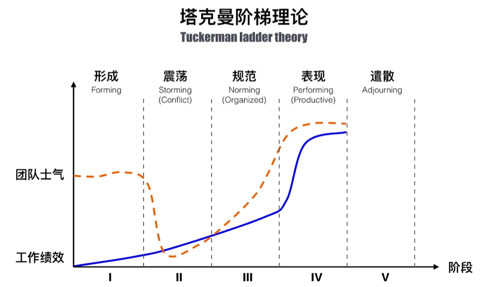
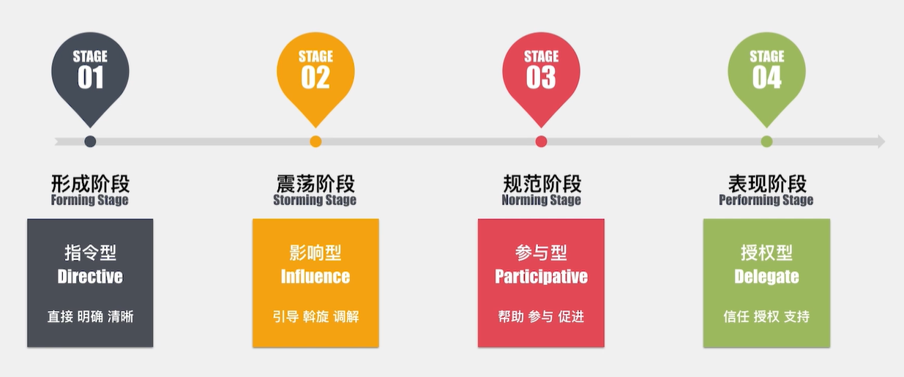
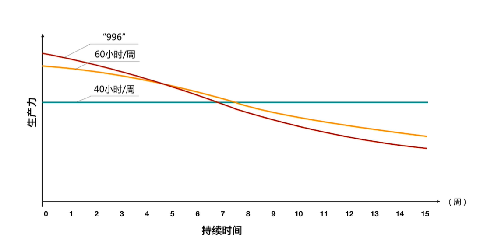
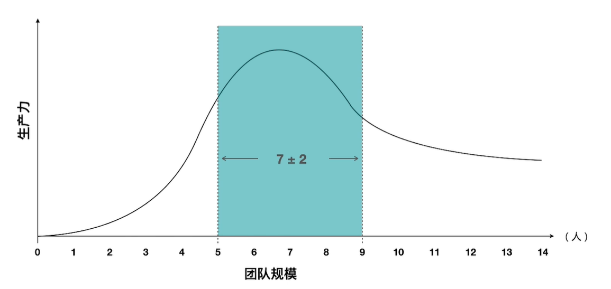
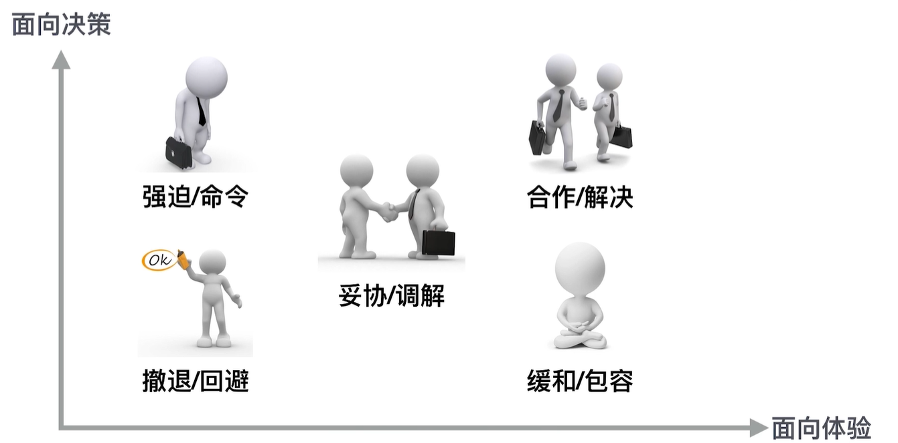
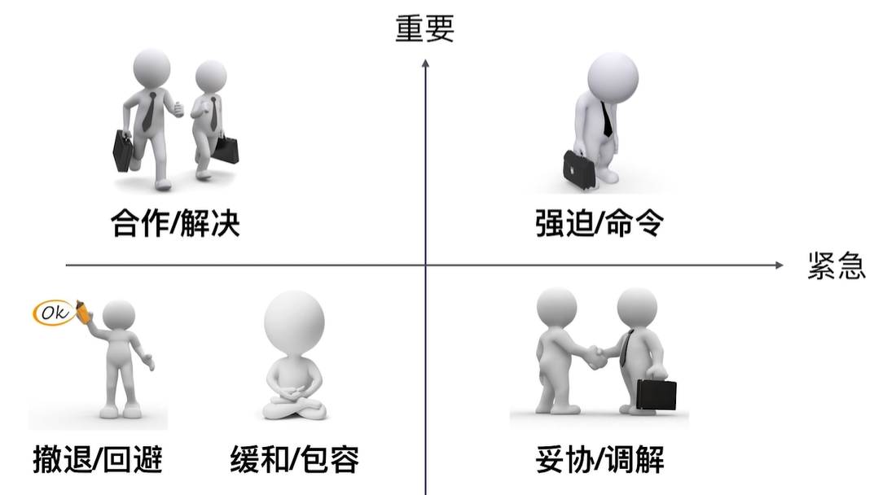
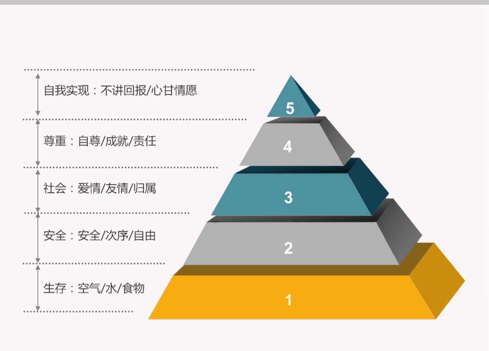
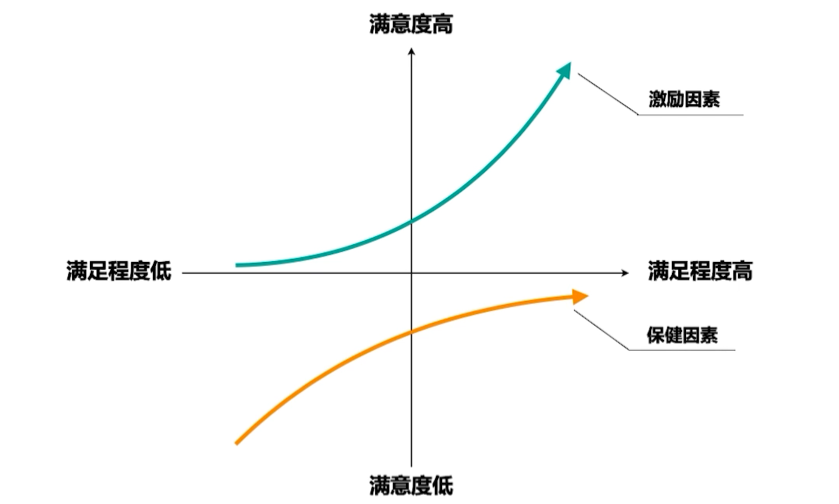
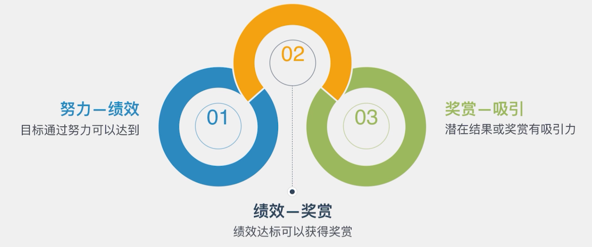

# 资源管理
* 规划资源管理
* 估算活动资源
* 获取资源
* 建设团队
* 管理团队
* 控制资源

项资源管理的趋势和新兴实践
* 自组织团队
  * 敏捷宣言中指出，最好的架构、需求和设计出自自组织团队
* 权利矩阵
* 虚拟团队 / 分布式团队
  * 不受地域，交通影响
  * 缺点是不利于团队充分讨论，沟通不到位，还会收到时差和文化的影响

项目资源特点：临时性、流动性、松散型、复杂性

## 规划资源管理
### 企业传统人力资源管理与项目人力资源管理
企业传统人力资源管理：选、用、育、留

项目人力资源管理：借、用、育、还

### 团队章程
* 团队价值观
* 沟通指南
* 决策标准和过程
* 冲突处理过程
* 会议指南
* 团队共识

### 培训
* 人力资源经理：公司规章、流程、制度
* 资源经理：业务、技术能力
* 项目经理：项目管理的知识、工具、方法
## 估算活动资源
### 资源分解结构（RBS）
建立工作和人的对应关系
### RACI矩阵
### 获取资源
获取资源的方法
* 预分派
  * 项目团队成员事先选定
* 谈判

选择队友
* 团队领导者越优秀，兼容性就越强
## 建设团队
### 塔克曼阶梯理论

### 项目经理的管理风格
* 形成阶段
  * 指令型
* 震荡阶段
  * 影响型
* 规范阶段
  * 参与型
* 表现阶段
  * 授权型

### 敏捷场景下的管理团队
||团队绩效评价|项目绩效评价|
|-|-|-|
|针对|人：项目团队|事：项目进度、成本等指标|
|标准|团队有效性|计划吻合度|
|过程组|执行过程组|监控过程组|
|方法|回顾会议|挣值分析|

团队工作时间与生产力

团队规模与生产力

## 管理团队
### 冲突管理
冲突的积极意义
* 促进磨合，增进了解
* 激发灵感，提升动力
* 暴露问题，降低风险
* 加速决策，改进管理

良性的冲突是指“对事不对人”

冲突的五种解决方法
* 撤退 / 回避
* 缓和 / 包容
* 妥协 /和解
* 强迫 / 命令
* 合作 / 解决问题

冲突性质与解决思路

## 控制资源
### 人员遣散计划
做好遣散计划的好处
* 控制成本
* 提升士气
* 降低风险

最好在项目开始时，就做好遣散计划
### 人力资源管理理论
* x-y理论
  * x理论：人都是懒惰的
  * y理论：人都是积极进取的
  * x-y理论认为，员工总会朝着你对他们建设的方向发展，强调环境改变人

### 马斯洛需求层次理论
马斯洛需求层次理论

企业对员工激励必须考虑人的不同需求，通过满足员工不同层次的需求来激发员工工作的积极性
### 双因素理论（激励-保健理论）
* 保健因素
  * 若不满足，员工就不会满意；满足了，不会更满意
  * 工作条件、工资、福利...
* 激励因素
  * 若不满足，员工不会不满意；满足了，员工才会更满意
  * 成就、赏识...

### 期望理论

## 知识点
* 自组织团队的特点
* 团队章程
* 培训的职责
* 获取资源中谈判的含义
* 塔克曼阶梯理论
* 项目经理在团队不同阶段的管理风格
* 团队绩效评价与项目绩效评价
* 冲突的积极意义
* 冲突的5种解决方法
* 人员遣散计划