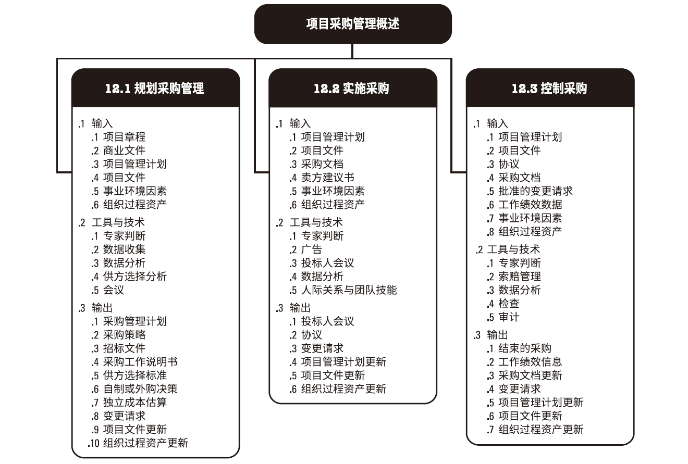
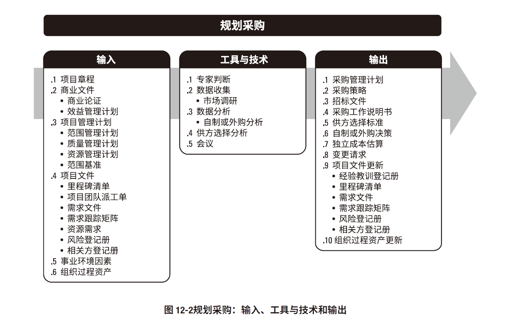
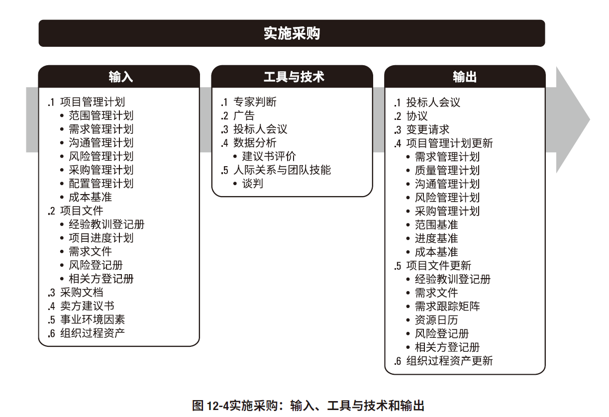
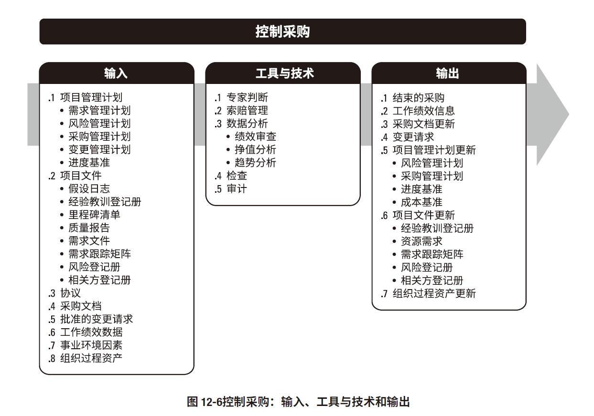

# 项目采购管理

## 规划采购管理

### 合同的类型
### 总价类合同
* 固定总价（FFP）
* 总价加激励费用（FPIF）
  * 按协商比例分摊超支或节约的成本
  * 价格会设置最高上限，高于上限的价格由卖方承担
* 总价加经济价格调整（FPEPA）
  * 履约期较长或将一不同的货币支付价款
  * 条件变化（通货膨胀等）可以对价格进行适当调整
### 成本补偿类合同
* 成本加固定费用（CPFF）
  * 该费用以项目初始估算成本的某一百分比计列
* 成本加激励费用（CPIF）
  * 按协商比例分摊超支或节约的成本
* 成本加奖励费用（CPAF）
  * 奖励由买方决定

### 工料合同
* 工料合同（T&M） 
  * 通常用于不确定性较高（无法快速编制出准确的工作说明书的情况下扩充人员、聘用专家或寻求外部支持）
## 实施采购

## 控制采购

