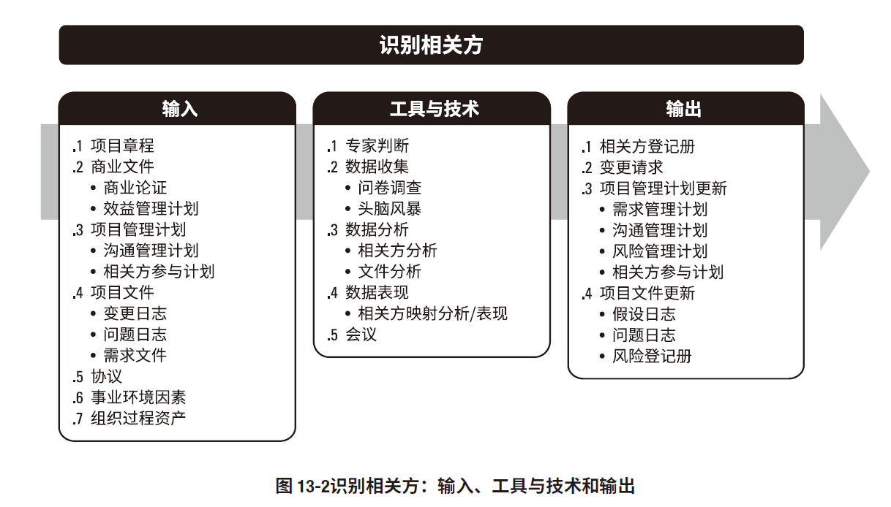
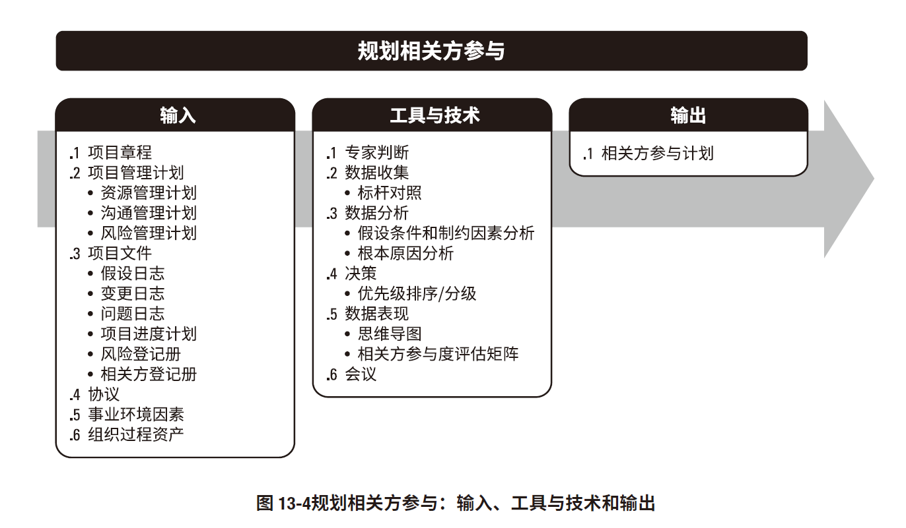
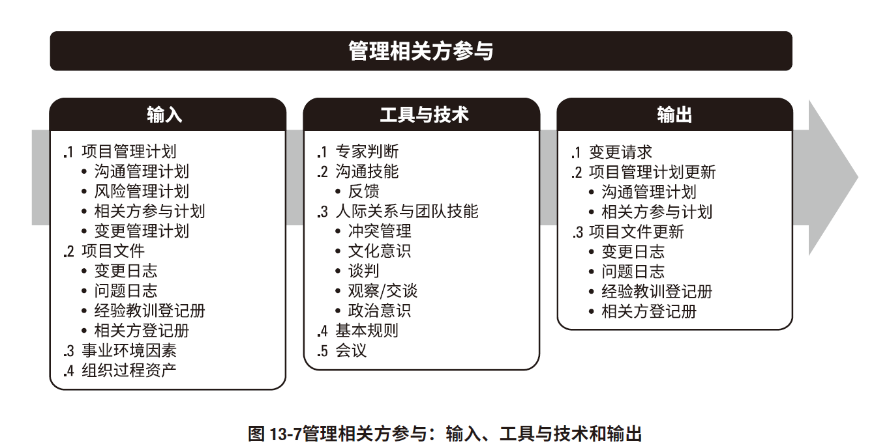
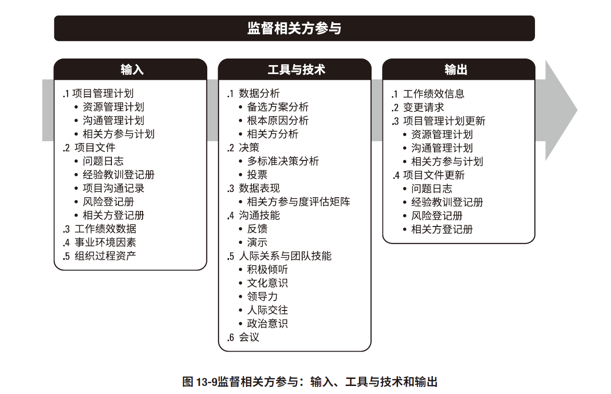
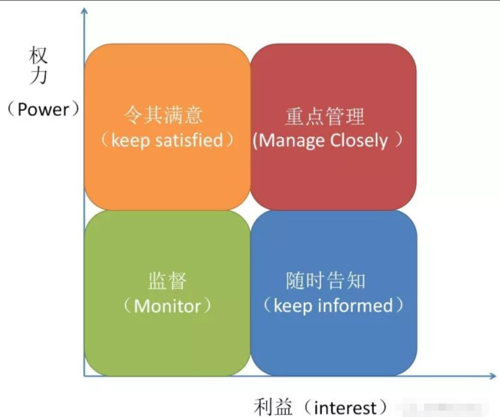

# 项目相关方管理

## 识别相关方

工具技术
* 专家判断
* 数据收集
  * 头脑风暴
* 数据分析
  * **相关方分析** ：位置、角色、与项目的利害关系、期望、态度等
    * 兴趣
    * 权力
    * 所有权
    * 知识
    * 贡献
  * 文件分析
* 数据表现
  * 权力-利益方格
  * 相关方立方体
  * 凸显模型
  * 优先级排序
  * 影响方向
* 会议
输出
* 项目管理计划更新
  * 需求管理计划
  * 沟通管理计划
  * 相关方管理计划
  * 风险管理计划
* **相关方登记册**
  * 身份信息
  * 评估信息
    * 主要需求、期望、影响项目结果的潜力...
  * 相关方分类
* 变更请求
* 项目文件更新

## 规划相关方参与 

工具技术
* 专家判断
* 数据收集
  * 标杆对照
* 数据分析
  * 假定条件和制约因素
  * 根据原因分析
* 决策
* 数据表现
  * 思维导图
  * 相关方参与度评估矩阵：当前参与水平与期望水平进行比较
    * 不了解型
    * 支持型
    * 反对型
    * 中立型
    * 领导型
* 会议

输出
* 相关方参与计划

## 管理相关方参与

工具
* 专家判断
* 沟通技能
* 人际关系和团队技能
* 基本原则
  * 根据章程 团队成员以。。。方式引导相关方参与
* 会议
  
输出
* 变更请求
* 项目管理计划更新
  * 沟通管理计划
  * 相关方参与计划
## 监督相关方参与

工具和方法
* 数据分析
* 决策
* 数据表现
* 沟通仅能
* 人际关系和团队技能
* 会议

输出
* 项目管理计划
  * 沟通管理计划
  * 资源管理计划
  * 相关方参与计划
* 工作绩效信息
* 项目文件
* 变更请求

权力利益方格

