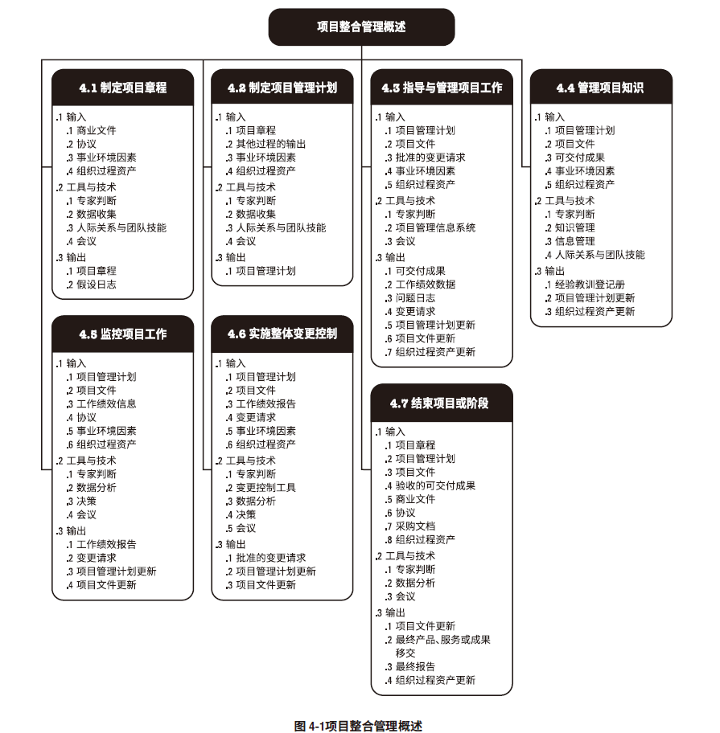
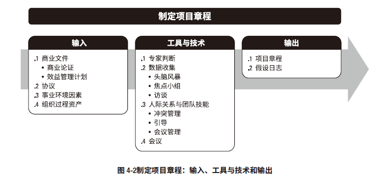
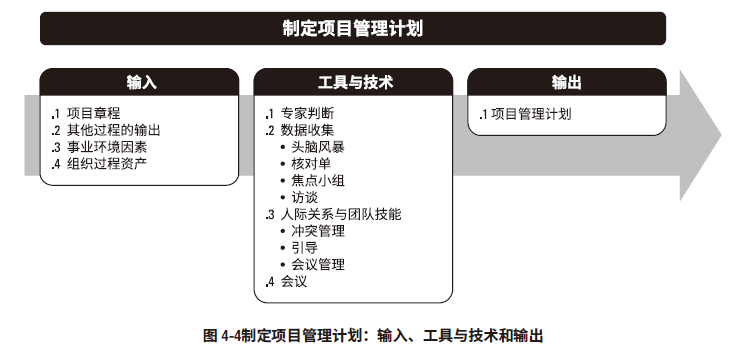
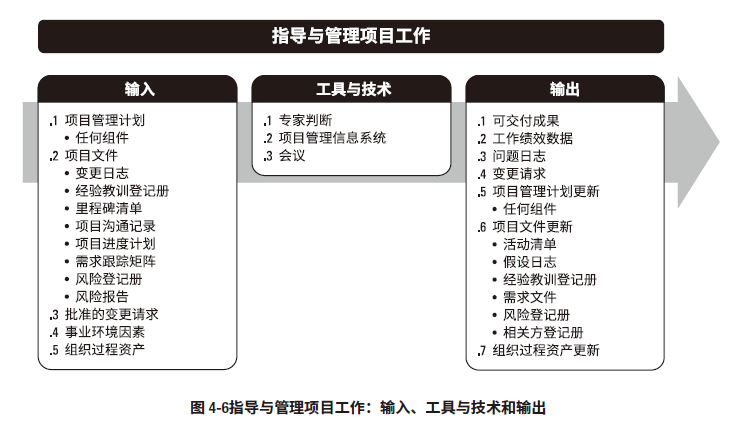
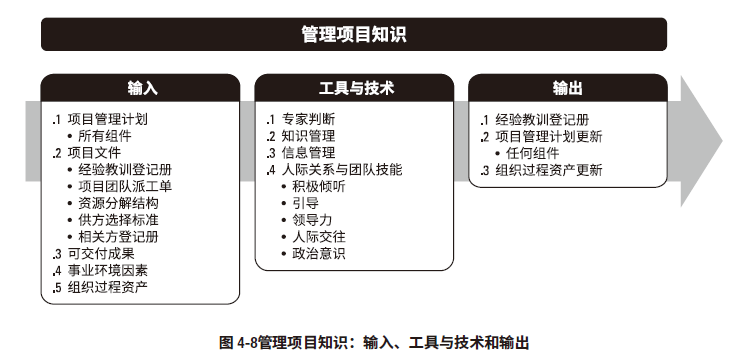
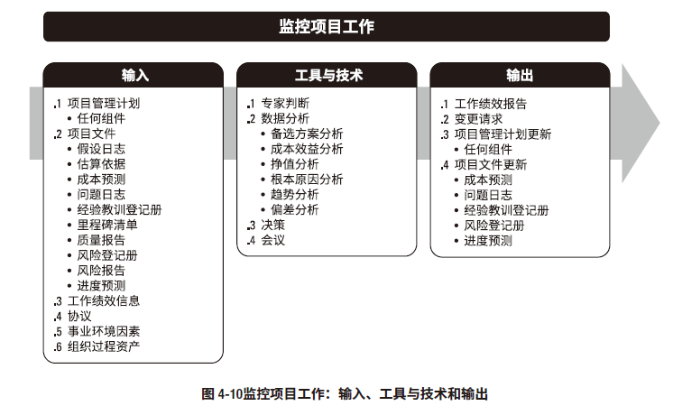
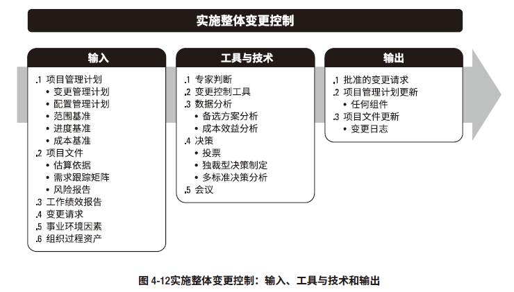
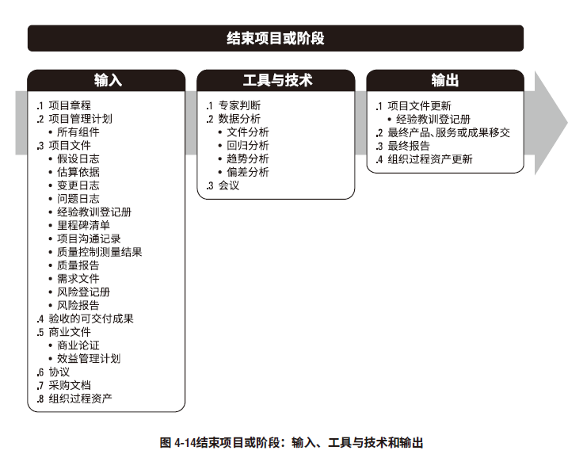

# 项目整合管理

## 制定项目章程

项目章程（P81 4.1.3.1），是由项目启动者或发起人发布的，正式批准项目成立，并授权项目经理使用组织资源开
展项目活动的文件。
* 项目目的
* 可测量的项目目标和相关的成功标准
* 高层次需求
* 高层次项目描述、边界定义以及主要可交付成果
* 整体项目风险
* 总体里程碑进度计划
* 预先批准的财务资源
* 关键相关方名单
* 项目审批要求（例如，用什么标准评价项目成功，由谁对项目成功下结论，由谁来签署项目结束）
* 项目退出标准
* 委派的项目经理及其职责
* 发起人或其他批准项目章程的人员的姓名和职权。

假设日志
* 通常，在项目启动之前编制商业论证时，识别高层级的战略和运营假设条件与制约因素。这些假设条件与制约因素应纳入项目章程。
* 
## 制定项目管理计划

## 指导与管理项目工作

## 管理项目知识

## 监控项目工作

## 实施整体变更控制

## 结束项目或阶段

 项目管理信息系统 (PMIS)
* PMIS 提供信息技术 (IT) 软件工具，例如进度计划软件工具、工作授权系统、配置管理系统、信息收集与发布系统，以及进入其他在线自动化系统（如公司知识库）的界面。自动收集和报告关键绩效指标（KPI）可以是本系统的一项功能。
* PMIS属于事业环境因素

配置管理系统
* 用于跟踪项目参数和监控这些参数变更的程序的集合。