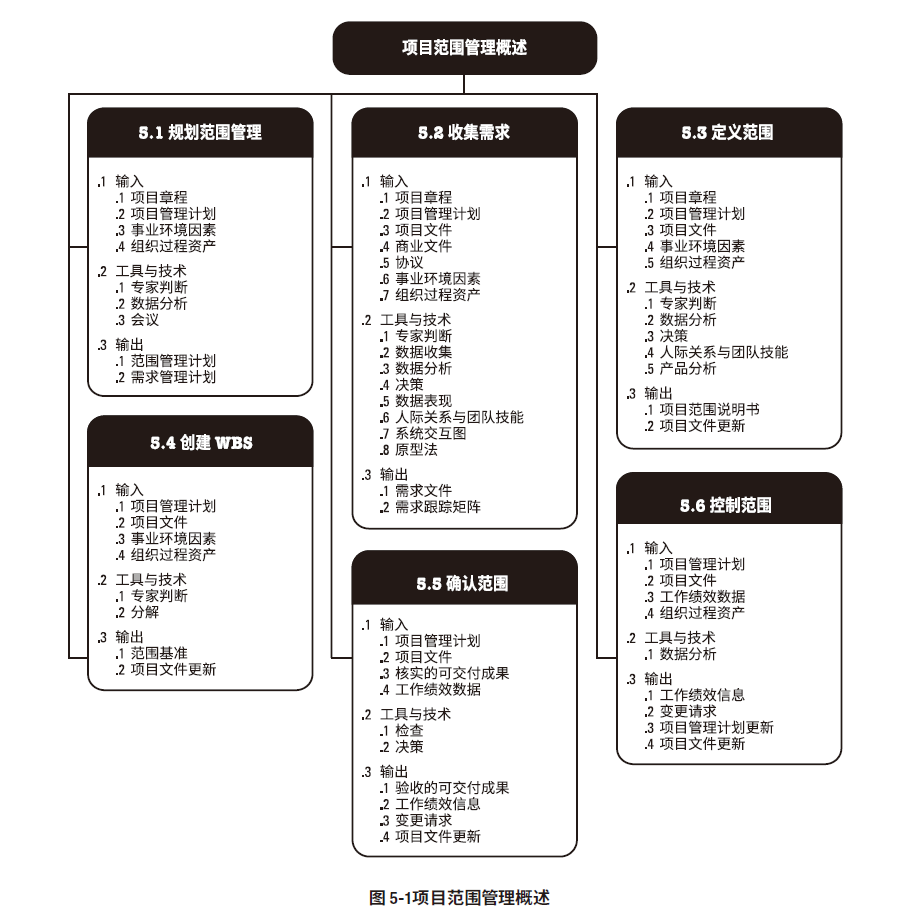
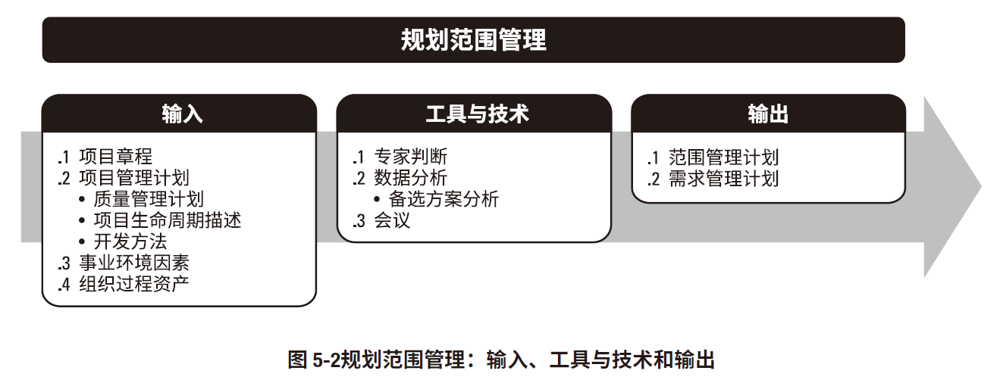
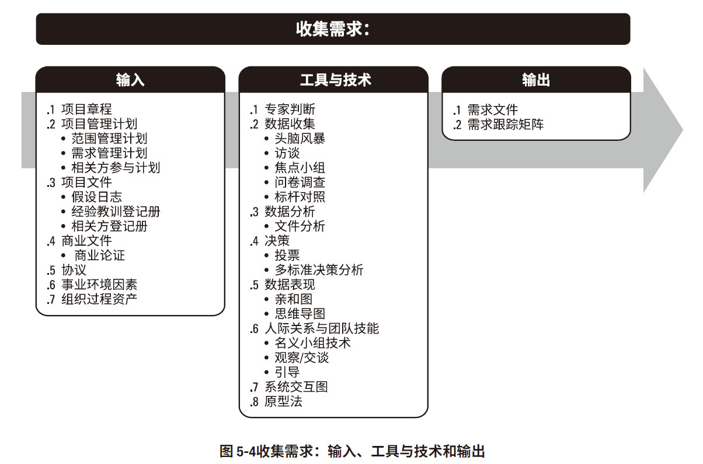
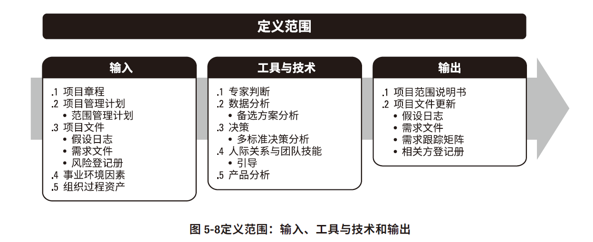
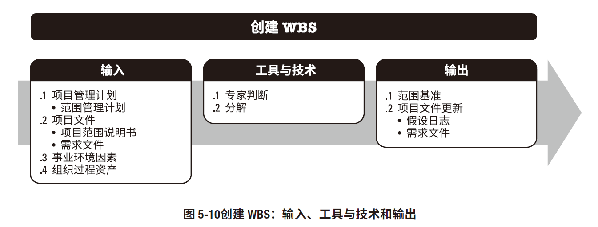
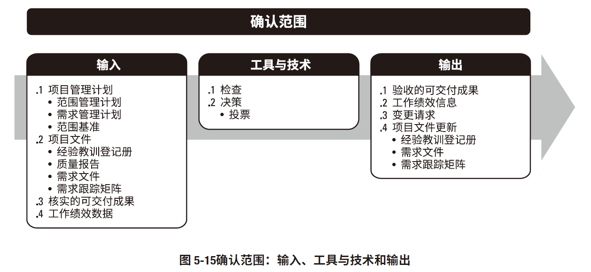
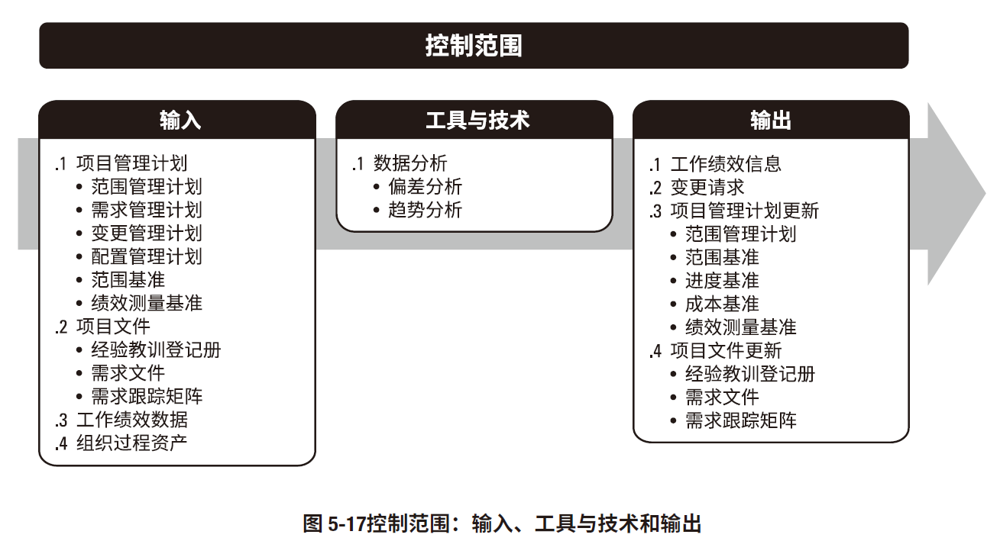

# 项目范围管理

## 规划范围管理

工具技术
* 专家判断
* 数据分析
  * 备选方案分析
* 会议

输出
* 范围管理计划
* 需求管理计划

## 收集需求

工具技术
* 专家判断
* 数据收集
  * 头脑风暴
  * 访谈
  * 焦点小组
  * 问卷调查
  * 标杆对照
* 决策
  * 头票
  * 多标准决策
* 数据分析
  * 文件分析
* 数据表现
  * 亲和图
  * 思维导图
* 人际关系与团队技能
  * 名义小组
  * 观察/交谈
  * 引导
    * 联合应用开发JAD
    * 质量功能展开
    * 用户故事
* 系统交互图
* 原型法

输出
* 项目文件
* 需求跟踪矩阵

## 定义范围

工具技术
* 专家判断
* 数据分析
  * 备选方案分析
* 决策
* 人际关系和团队技能
* 产品分析

输出
* 项目范围说明书
* 项目文件
  * 需求文件
  * 需求跟踪矩阵
  * 相关方登记册
  * 假设日志

## 创建WBS

工具技术
* 专家判断
* 分解

输出
* 范围基准
  * 项目范围说明书
  * WBS
  * 工作包
  * 规划包
  * WBS词典
* 项目文件

## 确认范围

工具技术
* 检查
* 决策

输出
* 验收的可交付成果
* 工作绩效信息
* 变更请求
* 项目文件更新

## 控制范围

工具技术
* 数据分析
  * 趋势分析
  * 偏差分析