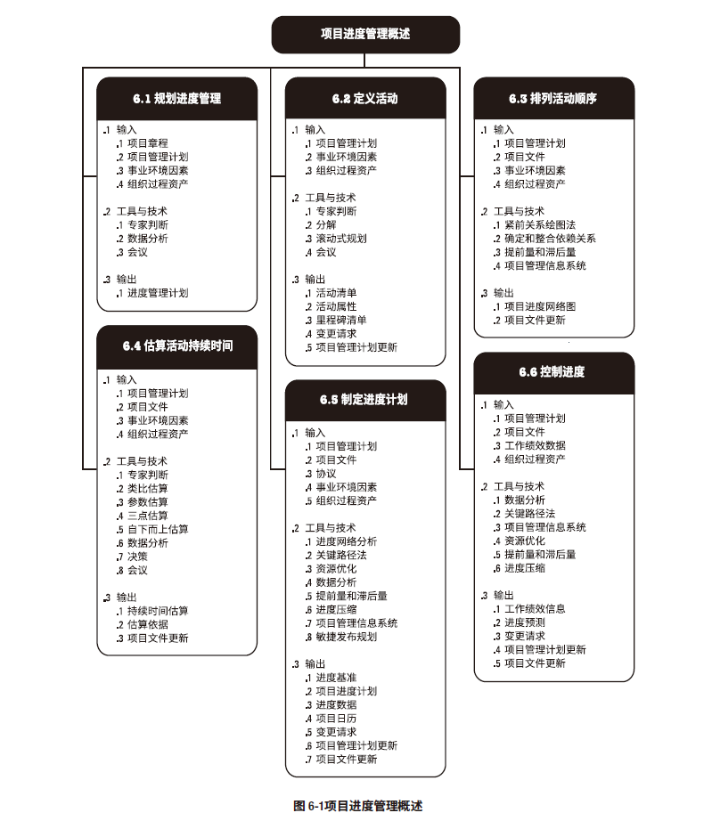
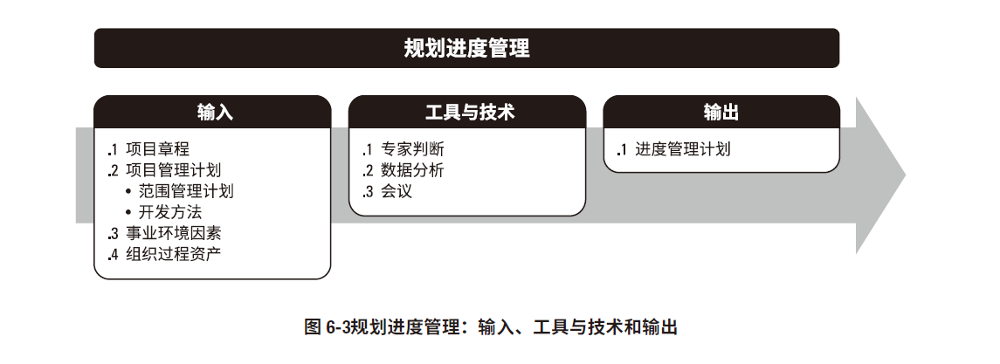
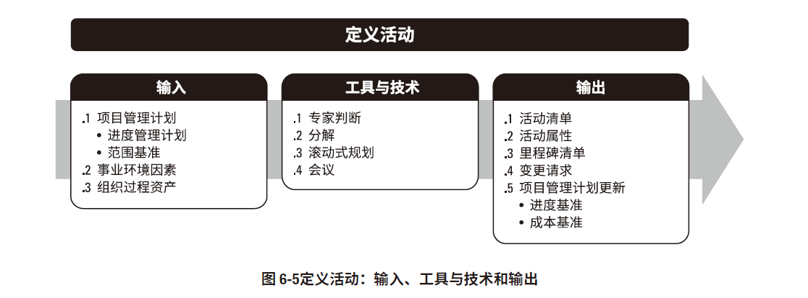
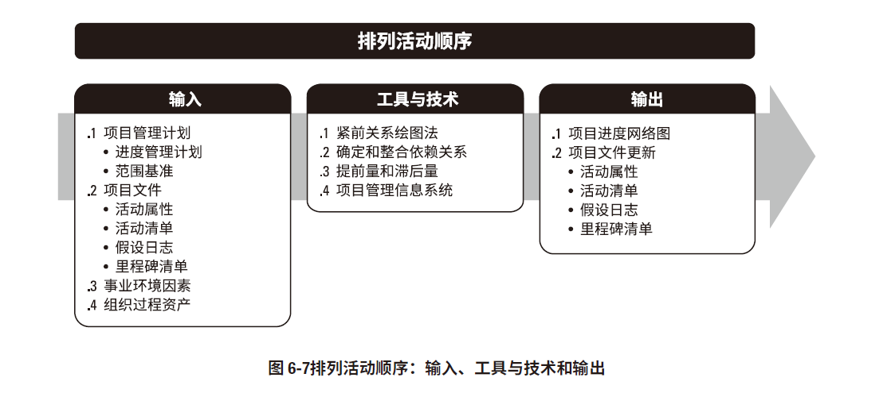
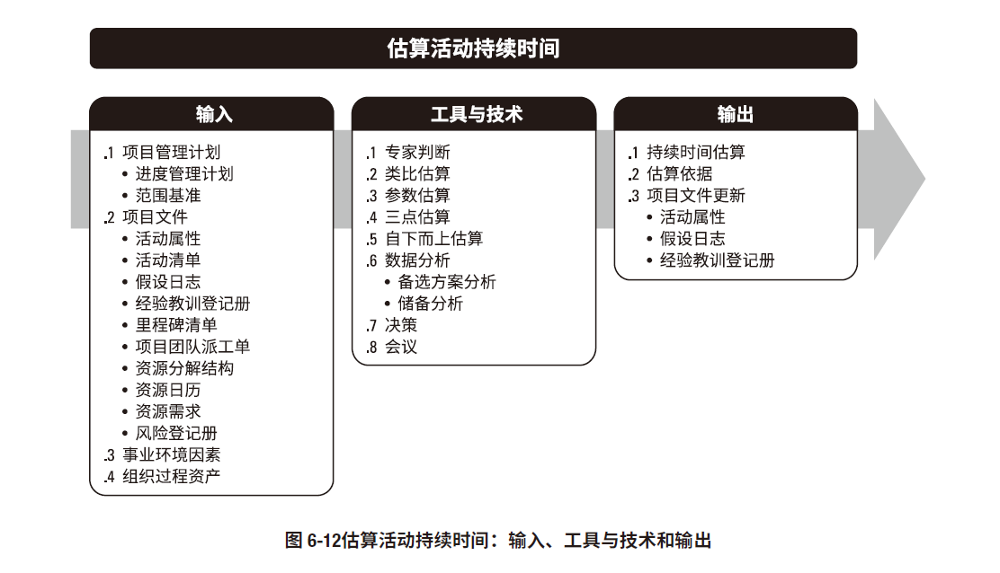
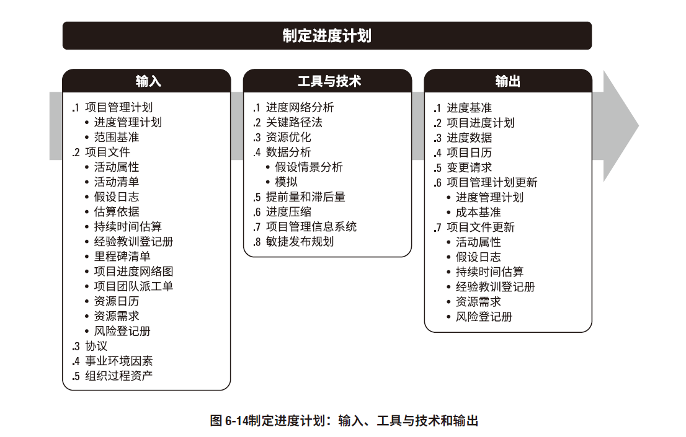
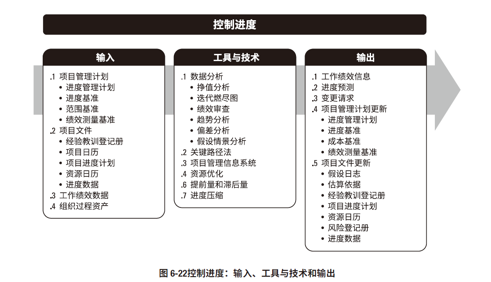

# 项目进度管理

项目进度管理发展的趋势和新兴实践
* 具有未完项的迭代型进度计划
  * 基于适应型声明周期的滚动式规划
* 按需进度计划
  * 来自看板方法中的拉动式生产
  * 根据团队的交付能力来限制团队正在开展的工作
## 规划进度管理

工具和方法
* 专家判断
* 数据分析
  * 备选方案分析
* 会议

输出
* **进度管理计划**
## 定义活动

工具和技术
* 专家判断
* **分解**
* **滚动式规划**
* 会议

输出
* **活动清单**
* **活动属性**
* **里程碑清单**
* ...
## 排列活动顺序
排列活动顺序是识别和记录活动之间的关系的过程，本过程的主要作用是定义工作间的**逻辑顺序**，以便在既定的所有项目制约因素下获得最高的效率

工具和技术
* **紧前关系绘图法**（PDM）
  * FS
  * FF
  * SS
  * SF
* 确定和整合依赖关系
  * 强制性依赖关系
  * 选择性依赖关系
  * 外部依赖关系
  * 内部依赖关系
* **提前量和滞后量**
  * 提前量：相对于紧前活动，紧后活动**提前**的时间
  * 滞后量：相对于紧前活动，紧后活动**推迟**的时间
* 项目管理信息系统（PMIS）

输出
* **项目进度网络图**
* 项目文件更新
  * 活动属性
  * 活动清单
  * 假设日志
  * 里程碑清单
## 估算活动持续时间
根据资源估算的结果，估算完成单项活动所需工作时段数的过程。本过程的主要作用是确定完成每个活动所需花费的时间量。

估算活动持续时间需要考虑
* 收益递减规律
* 资源数量
* 技术进步
* 员工激励

工具和技术
* 专家判断
* **类比估算**
* **参数估算**
* **三点估算**
  * 最乐观时间 O ，最可能时间 M ，最悲观时间 P 来计算概率分布值
    * β分布期望值计算公式：Te = (O + 4M + P) / 6
    * 标椎差 σ = (P - O) / 6
    * 三角分布 Te = (O + M + P) / 3
    * 正态分布，知道期望值 Te 与标椎差 σ
      *  ± σ 68.26%
      *  ± 2σ 95.46%
      *  ± 3σ 99.73%
* 自下而上估算
* 数据分析
  * 备选方案分析
  * 储备分析
* 决策
* 会议

输出
* 持续时间估算
* 估算依据
* 项目文件更新
## 制定进度计划
制定进度计划是分析活动顺序、持续时间、资源需求和进度制约因素，创建进度模型，从而落实项目执行和监控的过程。本过程的主要作用是，为完成项目活动而制定具有计划日期的进度模型

工具和方法
* 进度网路图分析
* **关键路径法**
* **资源优化**
  * 资源平衡
  * 资源平滑
* 数据分析
  * 假设情景分析
  * 模拟
* 提前量和滞后量
* **进度压缩**
  * 赶工
    * 增加资源
  * 快速跟进
    * 顺序的活动改成并行开展
* 项目管理信息系统（PMIS）
* 敏捷发布规划

输出
* **进度基准**
* **项目进度计划**
  * 横道图
  * 里程碑图
  * 项目进度网络图
* 进度数据
* 项目日历
* 变更请求
## 控制进度
控制进度是监督项目状态，以更新项目进度和管理进度基准变更的过程。本过程的主要作用是在整个项目期间保持对进度基准的维护

工具和方法
* 数据分析
  * 挣值分析
  * 迭代燃尽图
  * 绩效审查
  * 趋势分析
  * 偏差分析
  * 假设场景分析
* 关键路径法
* 项目管理信息系统（PMIS）
* 资源优化
* ...

输出
* 工作绩效信息
* 进度预测
* ...