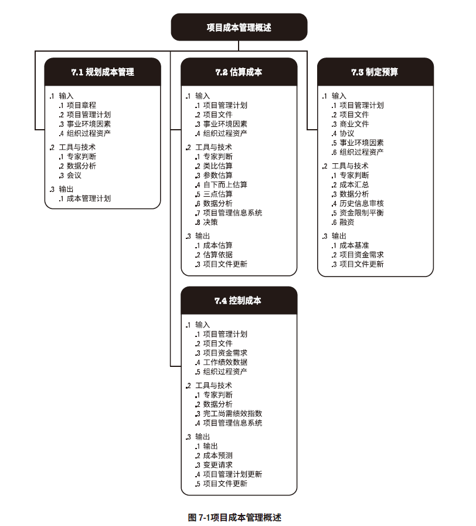
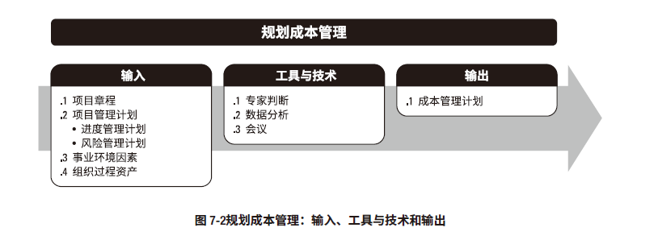
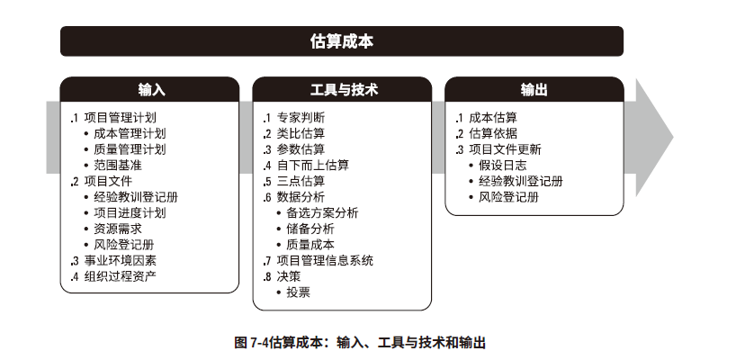
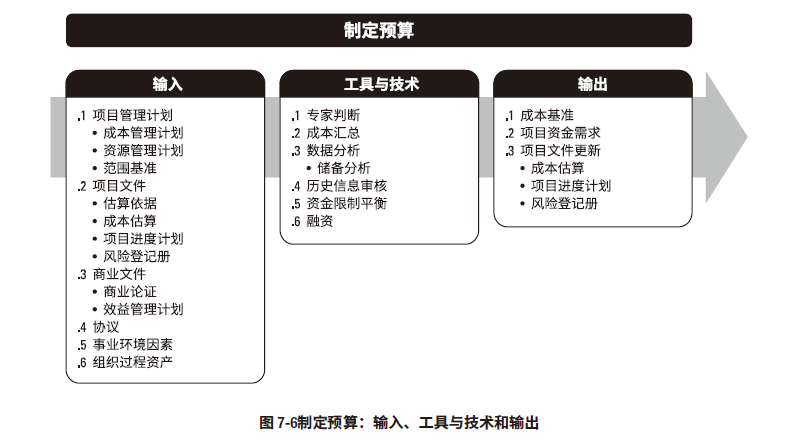
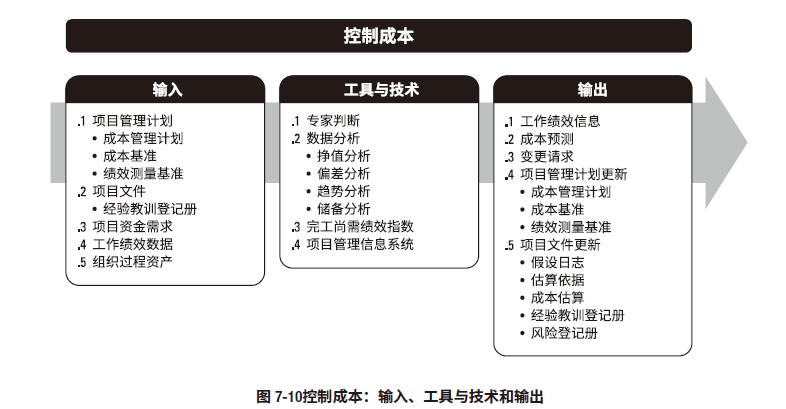
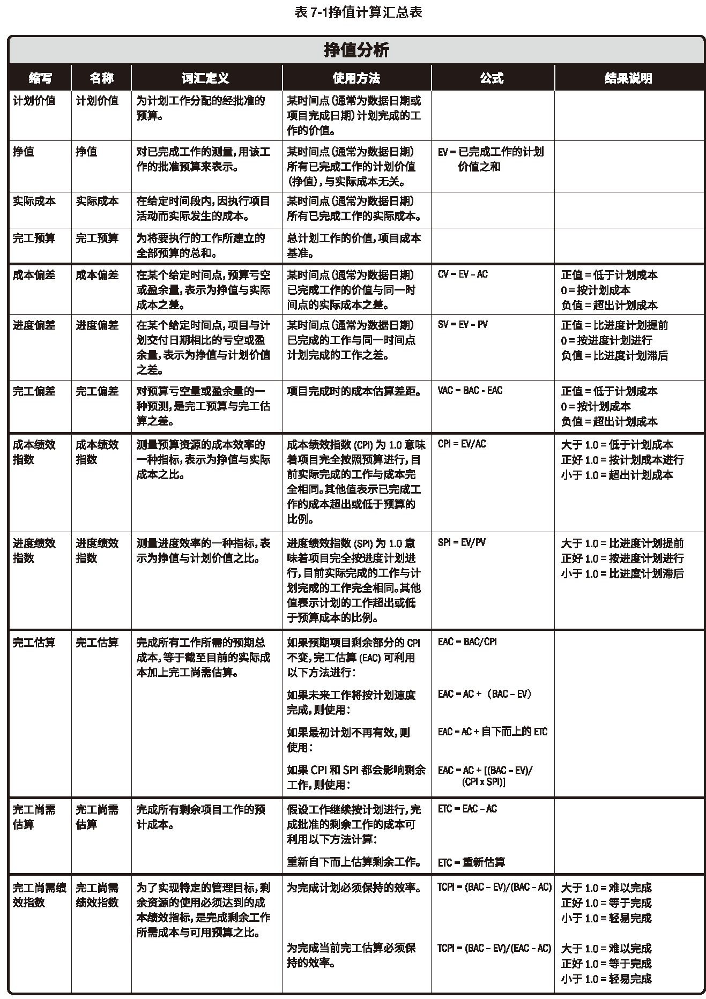

# 项目成本管理

## 规划成本管理

## 估算成本

工具和技术
* 专家判断
* 类比估算
* 参数估算
* 自上而下估算
* 三点估算
  * 三角分布 Te = (O + M + P) / 3
  * 贝塔分布 Te = (O + 4M + P) / 6
* 数据分析
  * 备选方案分析
  * 储备分析
  * 质量成本
* 项目管理信息系统（PMIS）
* 决策

输出
* **成本估算**
* **估算依据**
* 项目文件更新
  * ...

## 制定预算

工具技术
* 专家判断
* 成本汇总
* 数据分析
  * 储备分析
* 历史信息审核
* 资金限制平衡
* 融资

输出
* **成本基准**
* 项目资金需求
* 项目文件更新
  * 成本估算
  * 项目进度计划
  * 风险登记册
## 控制成本

工具和技术
* 专家判断
* 数据分析
  * 挣值分析
  * 偏差分析
    * 进度偏差
    * 成本偏差
  * 趋势分析
    * 图表
    * 预测
  * 储备分析
* 完工尚需绩效指数
  * 完工尚需绩效指数（TCPI）= (BAC-EV) / (BAC-AC)
* 项目管理信息系统

输出
* 工作绩效信息
* 成本预测
* 变更请求
* 项目管理计划更新
  * 成本管理计划
  * 成本基准
  * 绩效测量基准
* 项目文件更新
  * 假设条件
  * 估算依据
  * 成本估算
  * 经验登记册
  * 风险登记册
### 计算题相关
* EV 挣值
* AC 实际成本
* PV 计划值
* PB 项目预算
* BAC 完工预算
* EAC 完工估算
* ETC 完工尚需估算
#### 偏差
* 进度偏差 SV = EV - PV
* 成本偏差 CV = EV - AC
* 进度绩效指数 SPI = EV / PC
* 成本绩效指数CPI = EV / AC

#### 完工估算
* 按照之前的单价继续： EAC = BAC / CPI
* 按照计划的单价：EAC = AC + (BAC - EV)
* 进度和成本都按照之前的继续：EAC = AC +[(BAC-EV) / (CPI*SPI)]
* 完工尚需绩效指数：
  * TCPI0 = (BAC-EV) / (BAC-AC)
  * TCPI1 = (BAC-EV) / (EAC-AC)
* 完工偏差：VAC = EAC - BAC

